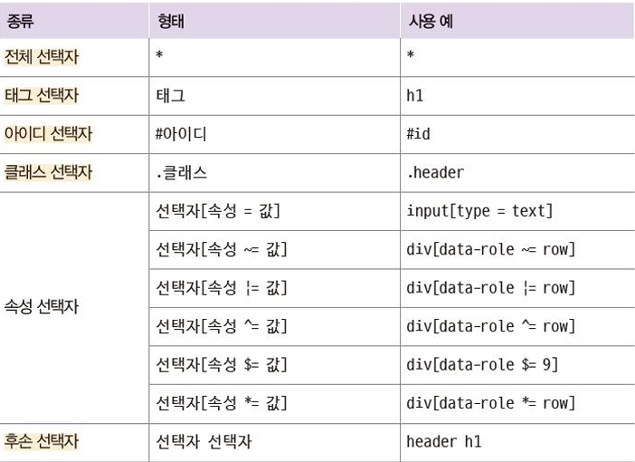
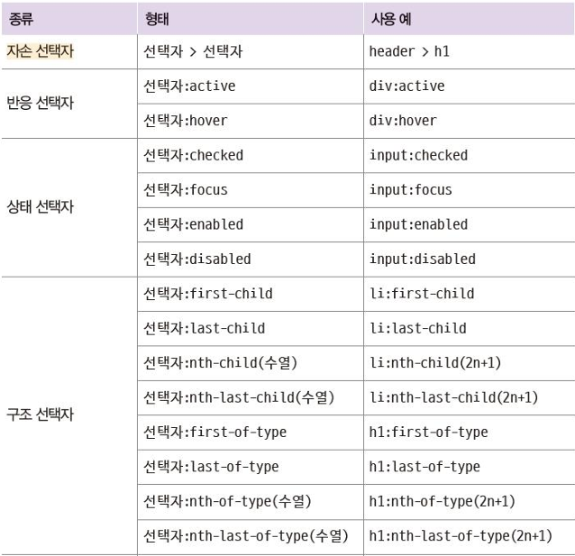
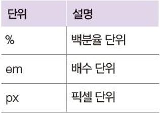
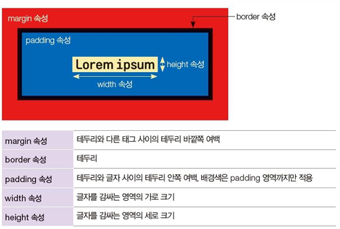
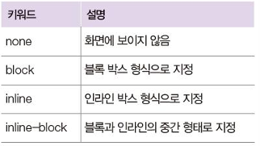
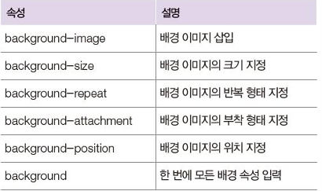
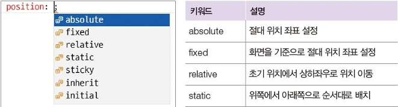
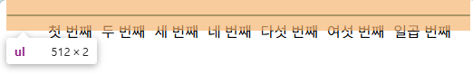
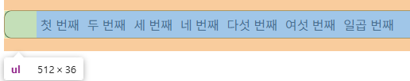

# CSS

## Day 003 - 2026-03-06

---

## 목차

1. 선택자
2. CSS 단위
3. CSS 속성
4. 추가 학습
5. 느낀점

## 1. 선택자

#### 선택자 종류


<br>


#### 예제 코드

- CSS 기본 구조
- 순서대로: 다중 선택, 전체 선택, 클래스 선택, 속성 선택, 후손 선택, 자식 선택자

```HTML
<style>
    h1, p, #id { color: red; }                          /* 다중 선택자 */
    * {
        background: black;
        margin: 0;
    }                                                    /* 전체 선택자 */
    li.select { font-size: 10px; }                      /* 클래스 선택자 */
    input[type="text"] { border: 1px solid #000; }      /* 속성 선택자 */
    #header h1 { text-shadow: 5px 5px 5px black; }      /* 후손 선택자 */
    header > p { margin: 3px; }                         /* 자식 선택자 */
    h1:hover { color: green; }                          /* 반응 선택자(hover) */
    h1:active { color: blue; }                          /* 반응 선택자(active) */
    input:focus { color: orange; }                      /* 상태 선택자 */
    input:disabled { color: gray; }                     /* 상태 선택자 */
    li:nth-child(2n) { background-color: #ff0033; }     /* 구조 선택자 */
</style>
```

```css
/* 자식 선택자(>) - 직계 자식만 */
div > p {
}

/* 후손 선택자(공백) - 모든 하위 요소 */
div p {
}
```

```text
div
├── p      ← 자식 ✅ 후손 ✅
└── span
    └── p  ← 자식 ❌ 후손 ✅
```

## 2. CSS 단위

#### 크기 단위



> [!TIP]
> `rem`: 루트(root) 글자 크기 기준 비율. 최근 많이 사용됨.

## 3. CSS 속성

#### 박스 속성



> [!NOTE]
> margin이 겹치는 경우(마진 상쇄), 합이 아니라 더 큰 값이 적용됨.

#### 가시 속성



| block          | inline           | inline-block   |
| -------------- | ---------------- | -------------- |
| 한 줄 차지     | 내용 크기만큼    | 내용 크기만큼  |
| 크기 지정 가능 | 크기 지정 불가능 | 크기 지정 가능 |
| div            | span             | img            |

#### 배경 속성



#### 위치 속성



#### 예제 코드

```html
<style>
  div {
    margin: 10px;
    padding: 0 30px 0 30px; /* 순서: 상 우 하 좌 */
    margin-left: 30px;
    border-width: thick;
    background-image: url('img1.png'), url('img2.png');
  }

  .text {
    font-family:
      '없는 글꼴', 'Georgia', 'Arial', sans-serif; /* 순서대로 적용 */
    text-align: center; /* inline 요소 자체 정렬은 불가(부모 기준 정렬) */
  }
</style>
```

### 추가 학습

#### DOM

DOM = Document Object Model

```text
document
└── html
    ├── head
    │   └── title
    └── body
        ├── h1
        ├── p
        └── div
            ├── p
            └── span
```

- `document`가 루트(root)

#### Bit / Byte

- 8 bit = 1 Byte
- 1,000 Byte = 1 KB
- 1,000,000 Byte = 1 MB
- 1,000,000,000 Byte = 1 GB
- 1,000,000,000,000 Byte = 1 TB

#### 색상 표기

- 16진수: `0x00` ~ `0xFF`
- RGB: `#RRGGBB` (예: `#FF0003`)
- RGBA: `rgba(255, 0, 3, 0.5)` 또는 `#RRGGBBAA`

## 정리

### 더 공부할 것

- [ ] image 여러 개 적용해보기(레이어 확인)
- [x] 자식과 후손 비교해보기
- [ ] CSS Position

### 기억할 내용

> [!NOTE]
> `head` 부분에 `style`을 사용하는 것이 일반적  
> 스타일 하나당 한 줄로 작성하면 가독성이 좋아짐  
> `class` 속성은 중복 적용 가능  
> 반응형을 위해 `font-size`는 `em/rem`, 길이는 `%` 사용 고려

> [!WARNING]
> [float 관련 에러 코드](../chapter5/ect_structure.html)
> 
> 
>
> float은 원래 텍스트가 이미지를 감싸도록 만든 속성이라 문서 흐름에서 빠져나올 수 있음.  
> 따라서 부모가 자식 높이를 인식하지 못해 높이가 0이 되거나 overflow 문제가 발생할 수 있음.  
> **해결 방법:** `overflow: hidden;` 또는 `display: flow-root;`, `display: flex;` 사용.  
> `overflow: hidden;` 사용 시 BFC(Block Formatting Context)가 생성되어 레이아웃이 분리됨.
