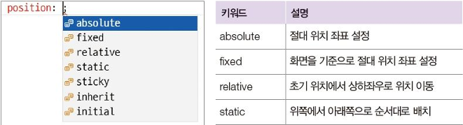
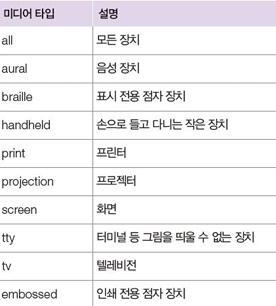
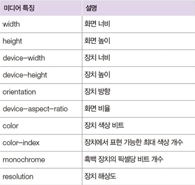
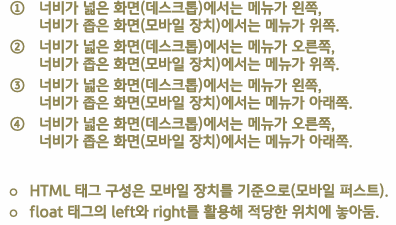

# css

## Day 004 - 2026-03-09

---

## 목차

1. CSS 속성 2
2. 레이아웃
3. 반응형 웹
4. 추가 학습

## CSS 속성 2

### 위치속성 (복습)



> [!NOTE]
> position: absolute, relative는 부모 기준으로 절대적 상대적 위치를 의미

> [!TIP]
> 자식이 absolute일 경우 부모에 `relative` 적용, 영역을 벗어나는 경우 `overflow` 적용

- `float` 속성: 태그를 왼쪽이나 오른쪽에 붙일 수 있게 함(고정 위치)

| 속성       | 기준점                    | 문서 흐름        | top/left 등 | 주요 특징                                               |
| ---------- | ------------------------- | ---------------- | ----------- | ------------------------------------------------------- |
| `static`   | 문서 일반 흐름            | 유지             | 사용 불가   | 기본값. 위에서 아래로 순서 배치                         |
| `relative` | 자기 자신의 원래 위치     | 유지 (공간 차지) | 사용 가능   | `absolute` 자식의 기준 부모로 활용, 원래 공간은 유지 됨 |
| `absolute` | 가장 가까운 position 부모 | 제거 (공간 없음) | 사용 가능   | position 부모 없으면 `body`/viewport 기준. 겹침 가능    |
| `fixed`    | viewport                  | 제거             | 사용 가능   | 스크롤해도 화면에 고정. ex) 맨위로 버튼                 |
| `sticky`   | 스크롤 위치               | 유지             | 사용 가능   | 특정 위치 도달 시 `fixed`처럼 동작. ex) 고정 메뉴       |

### 그림자 속성

#### 코드 예시

```HTML
<style>
    .box {
        box-shadow: 5px 5px 5px black; /*오른쪽, 아래, 흐림도, 색상*/
        text-shadow: 5px 5px 5px black;
    }
</style>
```

## 레이아웃

- 수평 정렬 : 자손에게 `float`, 부모에게 `overflow` or `clear` 적용(최근 스타일은 `clear`)
- 중앙 정렬 : `width` 적용 후 `margin: 0 auto;`(우측 정렬은 `margin-left:auto`)
- **One True 레이아웃** : 국내 모든 포털 사이트의 메인 페이지 레이아웃
- flex : `display:flex` PC=x축(가로), 스마트폰=y축(세로)
- 중앙 배치 : `position:absolute; left:50%;top:50%;` 적용 후 `margin-left``margin-top`에 음수를 입력
- 고정 배치 : `left:0; top:0; right:0;`

| 정렬                  | 방법                                                                                    |
| --------------------- | --------------------------------------------------------------------------------------- |
| 중앙 정렬             | `width` 적용 후 `margin: 0 auto;`(우측 정렬은 `margin-left:auto`)                       |
| **One True 레이아웃** | 국내 모든 포털 사이트의 메인 페이지 레이아웃                                            |
| flex                  | `display:flex` PC=x축(가로), 스마트폰=y축(세로)                                         |
| 중앙 배치             | `position:absolute; left:50%;top:50%;` 적용 후 `margin-left` `margin-top`에 음수를 입력 |
| 고정 배치             | `position:fixed`적용 후 `left` `top` `right` `bottom`으로 위치 지정                     |
| 글자 생략             | 글자가 영역을 넘는 경우 `text-overflow:ellipsis;` 적용하여 '...'으로 처리               |

#### 코드 예시

```HTML
<style>
    div.item{
        float:left;
    }
    div.clear{
        clear:both;
    }
    body{
        margin:0 auto; /* 중앙 정렬 */
    }
    #container{
        width:500px;
        height:250px;
        margin-left:-250px; /* margin값을 '-' 지정하여 특수하게 사용*/
        margin-top:-125px;  /* margin -값으로 중앙 정렬(flex로도 가능)*/
    }
    .top_bar{
        position:fixed;
        left:0; top:0; right:0;
    }
</style>
```

## 반응형 웹

- 장치의 크기가 달라 고정된 스타일 적용이 어려움
  1. 장치별로 분리된 스타일 사용
  2. 반응형 레이아웃 스타일 사용

### 반응형 웹을 위한 설정

- meta 태그
  - `name`, `content` 로 정보제공하며 주로 검색 엔진이 활용
  - `name : viewport content="user-scable-no,ininial-scale=1,maximum-scale=1`
- 미디어
  - `width`, `orientation` 주로 사용함
  - 
    

#### 예제 코드

```HTML
  <meta name="viewport" content="user-scalable=no,initial-scale=1,maximum-scale=1">
  <style>
  /* 스마트폰 */
  @media screen and (max-width: 767px) {
  body { background-color: red; }
  }
  /* 태블릿PC */
  @media screen and (min-width: 768px) and (max-width: 959px) {
  body { background-color: green; }
  }
  /* 데스크톱 */
  @media screen and (min-width: 960px) {
  body { background-color: blue; }
  }
  </style>
```

### 반응형 웹 패턴



### 개발자의 디자인 방법

- CSS Framework 사용해 클래스를 정의

  | Framework | 내용                               |
  | --------- | ---------------------------------- |
  | Bootstrap | 그룹 단위로 클래스가 정의되어 있음 |
  | tailwind  | 세부적으로 클래스가 정의되어 있음  |

- Font Awesome을 이용해 ICON 정의

## 추가 학습

| overflow 속성 | 내용 |
| ------------- | ---- |

|

## 정리

### 더 공부할 것

- [ ] `clear` 적용해보기
- [x] 반응형 웹에서 meta 태그 학습
- [ ] 디자이너가 정한 디자인과 개발자가 개발하는 디자인의 괴리

### 기억할 내용

```

```

```

```
