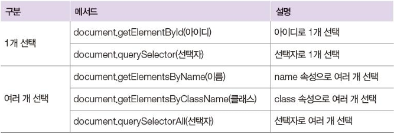
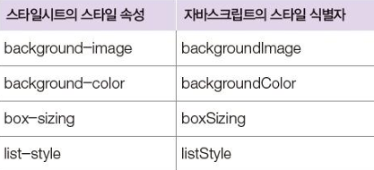
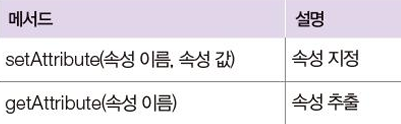
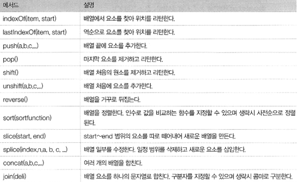

# JavaScript

## Day 006 - 2026-03-11

---

## 목차

1. 문서 객체 모델(Document Object Model)
2. 배열 메서드

## 문서 객체 모델(Document Object Model)

- 문서 객체
  - JS에서 사용할수 있는 HTML 태그의 객체 형태
  - HTML 태그는 TREE구조
- JS 제어
  1. 구조 조정
  2. 속성 제어

### 문서 객체 선택



> [!TIP]
> `querySelector`, `querySelectorAll` 두가지로 모두 커버 가능

|      | textContent                                                | innerHTML                                                |
| ---- | ---------------------------------------------------------- | -------------------------------------------------------- |
| 설명 | 문서 객체 내부 글자를 순수 텍스트 형식으로 가져오도록 변경 | 문서 객체 내부 글자의 HTML 태그를 반영해 가져오도록 변경 |
| 읽기 | 텍스트만 추출                                              | innerHTML은 태그까지 추출                                |
| 쓰기 | 태그포함 출력                                              | 태그는 렌더링                                            |
| 보안 | 안전                                                       | XSS 위험, 스크립트 동작함                                |




> [!WARNING]
> event_inline **비권장** : `<button onclick="alert('click')">버튼</button>`  
> event_inlineWithScript **비권장** : `<button onclick="buttonClick()">버튼</button>`  
> event_tradition **권장** : `<button id="button">버튼</button>`, script에서 이벤트 생성

```html
<head>
  <script>
    window.onload = function () {
      // 화면 객체 다 읽고 난 후 처리 (callback function)
      let header = document.querySelector('h1');
      let headers = document.querySelectorAll('h1');

      header.style.color = 'red';
      header.innerHTML = 'From JavaScript';
      header.textContent = '';
      header.style.backgroundColor = 'orange';
      header.style.height = '2px';

      let clock = document.getElementById('clock');
      setInterval(function () {
        let now = new Date();
        clock.innerHTML = now.toString();
      }, 1000);

      let button = document.querySelector('a[href="http://naver.com"]'); // a태그, 속성으로는 href="~" 인 것 찾기
      let button = document.getElementById('button');
      button.onclick = function () {
        alert('click');
        return false; // 기본 이벤트 핸들러 제거(href 제거)
      };
    };
  </script>
</head>
<body>
  <h1>Header1</h1>
  <h1>Header2</h1>
  <h1 id="clock"></h1>
  <a id="button" href="http://naver.com">버튼</a>
</body>
```

## 배열 메서드

- Array.from()
  - `const fruits = document.querySelectorAll('.fruits p');` NodeList 객체(유사배열)
  - `const fruitArray = Array.from(fruits);` NodeList -> Array
- Array.of()
  - `const digits = Array.of(1,2,3,4,5);` 전달받은 인수로 배열을 생성
- JS는 큐, 스택등 별도의 자료구조 없이 Array로 사용함
  - 

> [!NOTE]
> `splice(index, howmany, item1,...,itemX)` (위치, 삭제 개수, 입력 요소...)  
> `const score = [1,10,7,5]; score.sort();` 문자열로 비교  
> `score.sort((a,b) => a-b)` '-' 계산시 숫자로 계산하게 됨  
> `map`: 각 데이터 제어 `filter`: 데이터 갯수 제어

## 추가 학습

- ArrowFunction: JS에서 간단하게 사용하는 함수 작성법
  - `function f() {}`
  - `const f = () => {}`
- map: 각 요소를 순회하며 "새 배열"을 반환. 각 값들 수정
  - 단일 표현인 경우 `{}`, `return`을 생략할 수 있다.  
    `arr.map((item, index) => console.log(index, item));`
- filter: 각 요소를 순회하며 조건에 맞는 "새 배열" 반환, 각 값은 수정 X
  - `const result1 = arr.filter((item) => item >= 30);`

## 정리

### 더 공부할 것

- [ ]

### 기억할 내용

> [!TIP]
> 본 과정에서는 vanilla JS도 중요하지만 기본을 활용한 VUE의 사용에 중점을 둘 것!
