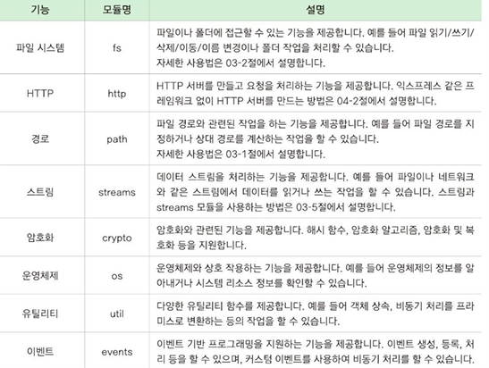

# node

## Day 007 - 2026-03-12

---

## 목차

1. 백엔드 기본
2. 추가 학습(fetch vs axios)

## 백엔드 기본 (Node)

- JSON(JavaScript Object Notation)
  - 자바스크립트에서 데이터를 저장하고 교환하는 텍스트 기반 데이터 형식
- Module
  - 기능을 나눈 하나의 JavaScript 파일
  - NPM (Node Package Manager)
    - Node.js의 패키지(라이브러리) 관리 도구
  - 모듈 불러오기
    - `const c = require('ansi-colors');` `const hello = require('./hello');`
    - 1순위: 내장모듈 2순위: node_module 3순위: 상위폴더
  - 모듈 내보내기
    - `module.exports = hello;` `module.exports = {user1,user2}`
    - 한 개만(객체로 1개도 가능) 배정 가능
  - 내장 모듈(코어 모듈)
    - 

- **package.json: "type": "module** 설정한 경우
  - 상수(const)와 함수만 export, import 가능
  - `export const goodbye = () => {}` : `import  {hello,goodbye} from './greeting.js'`
  - `export default goodbye` : `import hello from './greeting.js'`
- 화살표 함수(람다)
  - 짧고 간결
  - this 바인딩 해결

### 동기와 비동기

> [!NOTE] 비동기 처리 (Asynchronous)
> Node.js와 JavaScript에서는 시간이 걸리는 작업을 비동기 방식으로 처리한다.
> 예를 들어서 파일 읽기, 데이터베이스 조회, API 요청 등 이런 작업은 완료될 때까지 기다리면 프로그램이 멈추기 때문이다.

- 동기: 작업별로 기다리기(앞 작업이 끝나야 다음 작업 시작) (JAVA)
- 비동기: 작업이 끝나지 않아도 다음 작업 시작 (JavaScript)
- 비동기 처리 방법( 순서를 보장하는 방법 )
  1. Callback 이용
  2. Promise, then(resolve), catch(reject)
     - Promise는 미래에 완료될 작업의 결과를 나타내는 객체
  3. **async/await**
     - async 사용한 함수는 promise를 반환.
     - Promise를 더 읽기 쉽게 만든 문법
     - async → 비동기 함수 선언
     - await → Promise 결과 기다림

## 추가 학습

### AJAX / fetch / axios

**AJAX** — 페이지 새로고침 없이 서버와 데이터를 주고받는 **기술 개념**

| 항목                | fetch | axios |
| ------------------- | ----- | ----- |
| 브라우저 내장       | ✅    | ❌    |
| JSON 자동 변환      | ❌    | ✅    |
| HTTP 에러 자동 처리 | ❌    | ✅    |
| 인터셉터            | ❌    | ✅    |
| async/await         | ✅    | ✅    |

## 정리

### 더 공부할 것

- [x] 상수만 export 가능하다고??!! 함수도 가능함~

### 기억할 내용
