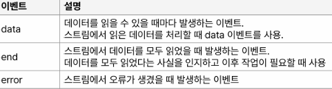

# node

## Day 008 - 2026-03-13

---

## 목차

1. 파일 관리하기
2. 동기와 비동기(심화)

## 파일 관리하기

- `const path = require('path')`
- `path.join(경로1, 경로2)`
- `path.dirname(경로)`
- `__dirname` : 현재 실행하는 파일의 디렉토리
- `__filename` : 현재 실행하는 파일

> [!TIP] 동기 비동기 구분 법
> (거의) return이 있다면 동기, callback이 있다면 비동기
> 파일 시스템은 동기, 비동기(콜백), 비동기(Promise)에 따라 사용 함수가 다름
> 접미어로 `sync` 가 있다면 동기, 없다면 비동기(`default`)

### read

```js
fs = require('fs');
path = require('path');

filepath = path.join(__dirname, 'example.txt');

fs.readFile(filepath, 'utf-8', (err, data) => {
  if (err) {
    console.error(err);
  }
  console.log(data);
});
```

### write

- 파일이 이미 존재하면 덮어쓰기
- 

```js
isFileExist = fs.existsSync(filepath);
if (fs.existsSync('./test')) {
  console.log('folder already exists');
} else {
  fs.mkdir('./test', (err) => {
    if (err) return console.error(err);
  });
  console.log('folder create');
}
```

### stream

- 데이터가 이동하는 흐름
- `fs.createReadStream(경로,내용[,옵션])
- 
- **rs.pipe(ws)**

```js
const fs = require('fs');
const path = require('path');

const readStream = fs.createReadStream(path.join(__dirname, 'readMe.txt'));
const writeStream = fs.createWriteStream(path.join(__dirname, 'writeMe.txt'));

readStream.on('end', () => {
  console.log('finished reading data');
});
readStream.on('data', (chunk) => {
  console.log('new chunk received:');
  console.log(chunk);
});
readStream.on('error', (err) => {
  console.error(err);
});

// 파이프로 한번에 읽고 쓰기
readStream.pipe(writeStream);
```

## 동기와 비동기(심화)

- 스레드 thread : 하나의 작업이 실행되는 최소 단위
- 싱글 스레드와 멀티 스레드: 멀티스레드의 오버헤드 관리 필요
- 싱글스레드의 관리 단순

```js
console.log('1번 작업');
setTimeout(() => console.log('2번 작업'), 0);
console.log('3번 작업');
```

## 정리

### 더 공부할 것

- [ ] 실제 지역변수는 heap에 저장되고, 관리도 stack과 별도로 관리됨 -> 클로저

### 기억할 내용

```

```
