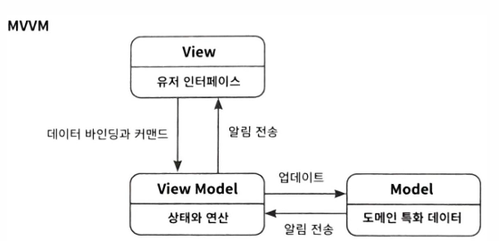
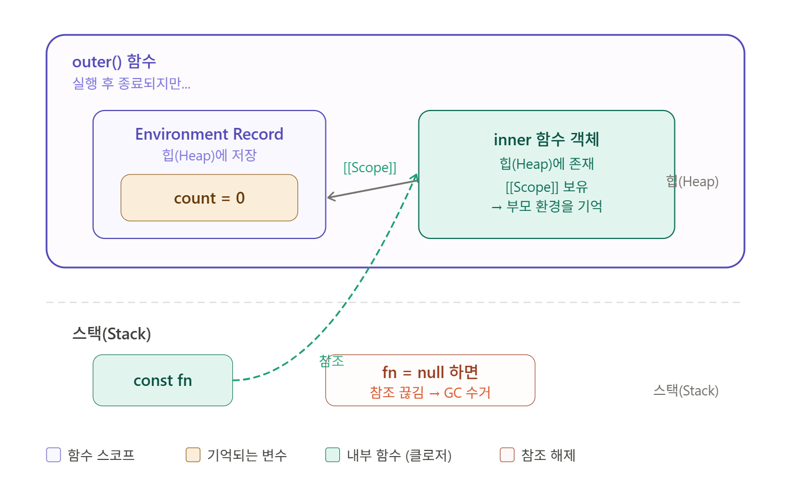

# vue

## Day 009 - 2026-03-16

---

## 목차

1. 함수 (심화)
2. VUE 기초

## 함수(심화)

### 내부함수

- 프로그램 개발시 네임 충돌 방지 방법
- 내부 함수는 함수 내부에 선언

```
function outer() {
return function() {
console.log('Hello Function...!');
};
}

// 호출1
outer()();

// 호출2
var fn = outer();
fn();

```

### 함수적 프로그래밍

- a = function() 형태

### 클로저

- 클로저 : "함수 안의 함수가 바깥 변수를 기억하는 것"

### 구조할당

- 객체리터럴( : )
- 가변 파라미터: fn foodReport(name,age,...favoriteFoods) - `...favoriteFoods`:가변

```
let p1 = {name:"홍길동",age:20}
let {name :n, age:a}=p1
```

### this

- 전통적인 함수에서 this와 화살표 함수의 this 비교

### 전개 연산자(spread operator)

- 파이썬의 `list[1,2,3] print(*list)`와 동일한 기능
- `...연산자` 대입문에서는 가변매개변수로 사용
- `let obj = {name:"홍길동"}`
- `let obj2 = obj1` : 참조 복사, 참조값 동일
- `let obj3 = {...obj1}` : obj를 나열해 새로운 객체로 저장(얕은 복사, 1depth만 생성)
- `let obj4 = {...obj,color:"red"}`

## VUE 기초

- {{message}} : 변수 출력 방법(중괄호 두개)
  파라미터로, 배열로 저장
  | vm.message | model.messag |
  | ----------- | ------------ |
  | 화면 갱신 O | 화면 갱신 X |
  | 함수 동작 | 단순 대입 |

```HTML
<div id="app">                                  <!--View -->
  <h2>{{message}}</h2>
</div>
<script src="https://unpkg.com/vue"></script>
<script>                                        //ViewModel
  let model = {message: "Hello Vue3!"};
  let vm = Vue.createApp({
      name:"App",
      data(){
          return model;
      }
  }).mount('#app')
</script>
```

#### MVVM



## 정리

### 더 공부할 것

- [ ] 클로저 개념 및 활용
       - inner 함수가 outer의 변수 참조를 유지하는 것 - const fn = outer()의 fn이 끊어지면 (fn=null) 참조 끊어짐
- [ ] self 와 this (화살표 함수와 일반 함수) - python에서는 seft와 this 같음 (관례상 self로 사용) - JS

  | 메서드                      | 화살표 함수                       |
  | --------------------------- | --------------------------------- |
  | 호출한 객체                 | 바깥 스코프(태어난 곳의 this)     |
  | 누가 호출하냐에 따라 달라짐 | 선언 시점의 this를 고정           |
  | 객체의 데이터 접근시 사용   | 콜백(누가 호출할지 모를때)에 사용 |

### 기억할 내용

```

```
