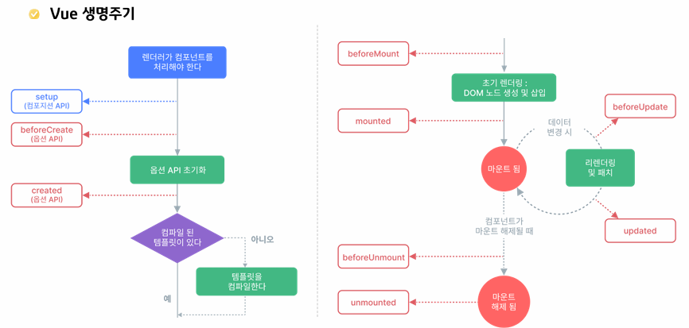

# Vue

## Day 012 - 2026-03-19

---

## 목차

1. proxy
2. Vue 디렉티브
3. Vue 인스턴스

## Proxy

- 객체의 속성을 읽어오거나 설정하는 작업을 가로채기 위해 래핑할 수 있도록 하는 객체
- 내부에 있어 실제로 확인은 안됨
- 원본이 변경되는 함수(map,sort,splice)의 경우 Vue에서 proxy로 관리하며 자동 rerendering 됨
- Proxy는 data()에서 반환된 객체를 감시하기 위해 Vue가 내부적으로 만들어 줌.
  - Vue가 message 객체를 Proxy로 감싼다
  - Proxy가 읽기/쓰기를 감지
  - 값이 바뀌면 자동으로 화면 업데이트

```js
let obj = {name:"홍길동", age:20};
cosnt proxy = new Proxy(obj,{
    get: function(target,key){      //target은 첫 인자인 obj
        console.log("## get" + key)
    }
})
```

## Vue 디렉티브

- html 요소 중 v-로 시작되는 속성으로 단방향임(script->html)
- `v-text` `v-html`
  - `<h2 v-text="message"><h2>`
  - message는 data 리턴 객체의 속성명 (vm.message)(vm은 html의 this)
- `v-vind`
  - 요소의 속성을 proxy객체에 바인딩(연결)
  - 보통 input같은 form 요소를 proxy에 전달
  - v-bind:속성(html 속성명) = "표현식"
  - :속성="표현식" 으로 축약가능
- `v-model`
  - 양방향 바인딩
  - 강사님 개인적으로 생각하는 다른프레임워크와 비교했을때 가장 좋은 기능(react에서는 이베트리스너 등을 이용해야 함)
  - 체크박스 등 사용에 좋음
  - 수식어: v-model.lazy
    - lazy: input에서 엔터, 포커스 이동시 입력값 동기화
    - number: 문자열을 숫자로 자동 형변환
    - trim: 문자열의 앞뒤 공백 제거
  - 한글처리의 경우 입력이 한글자 단위로 바인딩 됨
- `v-show` , `v-if`
  - css의 display와 비슷
  - v-if는 dom 자체를 추가, 제거하며 조작 : mount, un mount
  - v-else, v-else-if 로 다중 if문 사용 가능
  - v-show는 dom에는 항상 존재
- `v-for`
  - 반복문, 목록 만들때 주로 사용
  - `<div v-for="(val,key) in 객체":key="key">`
  - `<div v-for="(contact,index) in contacts"...>` : index 사용도 가능
  - `<template v-for="...">` : 리액트의 <></> 빈태그와 같은 역할
  - key 속성이 없는 경우 전부 다시 렌더링되므로 부여하는걸 권장

## Vue 인스턴스

- **애플리케이션 인스턴스** Vue.createApp()로 만든 객체
- data 옵션
  - 리턴 객체가 Proxy로 래핑됨
  - vm.xxx 로 사용
- **계산된 속성**(computed 옵션)
  - data나 다른 속성이 변경될 때 함수가 실행되어 계산된 값을 사용하기 위함
  - computed 옵션에 함수를 등록
  - 함수명이 계산된 속성명이 됨
  - react의 useEffect()와 같은 역할로 값이 바뀌면 바로 갱신됨
- methods 옵션
  - Vue 인스턴스에서 사용할 메서드를 등록하는 옵션
- 관찰 속성 (watch 옵션)
  - js 코드에서 데이터가 변경된 경우
  - 주로 긴 처리시간이 필요한 비동기 처리에 사용
  - 화면을 직접 바꾸지 않음
  - 값이 바뀜을 감지할 때 사용

  | computed                      | methods                     |
  | ----------------------------- | --------------------------- |
  | 계산된 값                     | 함수                        |
  | 캐쉬로 호출 없이 사용됨       | 매 호출 마다 새로 실행됨    |
  | 데이터 가공해서 보여줄때 사용 | 클릭이나 이벤트 처리에 사용 |

```html
<body>
  <div id="app">
    1보다 큰 수: <input type="text" v-model.number="num" />
    <br />
    1부터 입력한 값까지의 합: <span>{{sum1}}</span><br />
    1부터 입력한 값까지의 합: <span>{{sum2}}</span><br />
    <br />
    x : <input type="text" v-model.number="x" /><br />
    y : <input type="text" v-model.number="y" /><br />
    덧셈결과: {{sum3}}
  </div>
  <script src="https://unpkg.com/vue"></script>
  <script>
    let vm = Vue.createApp({
      name: 'App',
      data() {
        return { num: 0, x: 0, y: 0, sum3: 0 }; //proxy 객체가 리턴됨
      },
      computed: {
        // 계산된 속성
        sum1() {
          console.log('## computed num: ' + this.num);
          let n = parseInt(this.num);
          if (Number.isNaN(n)) return 0;
          return (n * (n + 1)) / 2;
        },
      },
      methods: {
        // 메소드 옵션
        sum2() {
          console.log('## mthod num: ' + this.num);
          let n = parseInt(this.num);
          if (Number.isNaN(n)) return 0;
          return (n * (n + 1)) / 2;
        },
      },
      watch: {
        // 관찰 옵션
        x(current, old) {
          console.log(`## x : ${old} --> ${current}`);
          var result = Number(current) + Number(this.y);
          if (isNaN(result)) this.sum = 0;
          else this.sum3 = result;
        },
        y(current, old) {
          console.log(`## y : ${old} --> ${current}`);
          var result = Number(this.x) + Number(current);
          if (isNaN(result)) this.sum = 0;
          else this.sum3 = result;
        },
      },
    }).mount('#app');
  </script>
</body>
```

### 생명주기



- > [!TIP]
  > create
  > 가장 많이 사용하며 반응형 데이터가 다 준비된 시점에 사용
  > 서버와 통신하여 초기데이터 다운로드( 비동기 )
  >
  > mounted
  > 서버 데이터 받기 전 호출
  > 초기 데이터 다운 완료되면 리렌더링 됨
  >
  > | created        | mounted        |
  > | -------------- | -------------- |
  > | dom 미완성     | dom 완성       |
  > | data 접근 가능 | data 접근 가능 |

## 추가 학습

### Vue 특징

- Proxy 기반 반응성 시스템 - 반응성 추적을 개선하고 성능 향상
  성능 개선
- TypeScript 지원 강화?
- fragment 지원 - <></>

## 정리

### 더 공부할 것

- [ ] 보간법(?)

      질문

- 모든 변수를 data에 등록 해야 하는지? - NO
- vm 객체는 어플리케이션 하나당 하나만 생성하는지 - NO
- data에 등록된 객체는 전역으로 사용 가능한지? - NO

### 기억할 내용

> [TIP]
> Tanstack query는 서버 상태관리 라이브러리로 전역 캐시로 데이터 관리도 가능함..
> 앱 전역으로 쓰는 서버 데이터(login여부), 혹은 서버와 관련 없는 데이터만 zustand로 하면 됨
