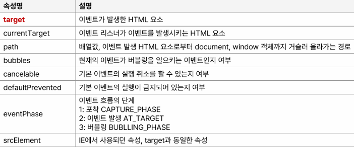
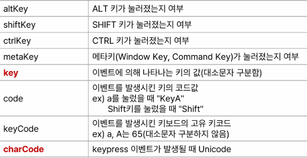
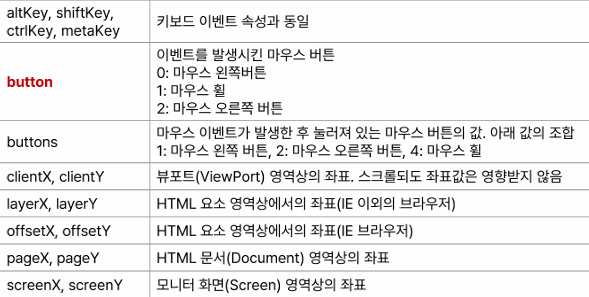
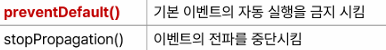

# event

## Day 014 - 2026-03-23

---

## 목차

1. 이벤트 처리
2. 스타일

## 이벤트 처리

- inline(비권장)
- `v-on:` = `@`
- `<button> v-on:click="balance += parseInt(amount)"> 입금 < /button>`
- 이벤트 핸들러 메서드: method 속성

```HTML
    <button @click="deposit">입금</button>
```

```js
    methods:{
      deposit(){            // 지역변수 this 사용해야 하므로 화살표 함수 사용하면 안됨
        let amt = parseInt(this.amount);
        if (amt <= 0) {
        alert("0보다 큰 값을 예금하세요.");
        } else {
        this.balance += amt;
        }
      }
    }
```

### 이벤트 객체






- `@contextmenue` : 마우스 우클릭
- `@이벤트.prevent` : 해당 이밴트 차단(event.preventDefault()와 동일0)

### 이벤트 전파와 버블링

- 이벤트 전파
  - 하나의 클릭 이벤트가 DOM을 따라 이동하는 것
  - 브라우저의 DOM 이벤트 흐름을 그대로 따르는 구조
  - 이동 경로는 캡처링↓ → 타겟 → 버블링↑
  - Vue의 기본은 버블링 위주
  - 이벤트.stop 사용시 버블링 방지
  - 우선순위
    1. capturaing(이벤트.capture 한 부모 먼저 처리)
    2. rasing(클릭 발생)
    3. 버블링 : 버블링 차단을 위해 `event.stopPropagtion()` = `.stop`

- 이벤트 중첩 시 (outer, inner)
  - `currentTarget`: 이벤트를 처리하는 요소(부모가 될 수 있음), `target`: 실제 이벤트가 발생한 요소

### 이벤트 수식어

- `@이벤트.enter=""`
- `keyup.ctrl.enter=""` : ctrl+enter 조합시
- `@click.ctrl.exact=""` : 정확히 ctrl 만 클릭시

## 스타일

- 스타일 적용 순서:
  1. 인라인
  2. style 태그
  3. link "css"
- script 에서 스타일 적용시 '' 내부 케밥표시(-) or 카멜 표기법 사용(style 구역에서는 케밥)
- `v-bind:style`
- `v-bind:class=""` or `:class""` : 클래스명 문자열 바인딩(제어 불편)하거나 객체를 바인딩

### HTML의 스타일 적용

```HTML
<button :style="sytle1">
<button :style="{backgroudcolor, color}">
<button :style="[myColor,myLaout]">
```

### css 클래스 바인딩

- class 속성으로 동적으로 변환하는 방법
- `<button class="staticBorder":class="myColor"> data(){ return(myColor:"buttonColor buttonLayout")}:클래스, 문자열 바인딩 함께 사용

- **객체(true/false) 값을 가진 객체 바인딩**
  - 속성명으로 클래스명 지정(같은 이름 사용해야 함)
  - 속성값으로 해당 클래스 적용 여부를 true/false로 지정

```HTML
<head>
    <style>
      .buttonColor {
        background-color: aqua;
        color: black;
      }
      .buttonLayout {
        text-align: center;
        width: 120px;
      }
      .staticBorder {
        border: khaki dashed 1px;
      }
    </style>
  </head>
  <body>
    <div id="app">
      <input type="checkbox" v-model="btnStyle.buttonColor" /> 색상<br />
      <input type="checkbox" v-model="btnStyle.buttonLayout" /> 정렬, 크기<br />
      <input type="checkbox" v-model="btnStyle.staticBorder" /> 테두리 <br />

      <button :class="btnStyle">버튼</button>
    </div>
    <script src= "https://unpkg.com/vue"></script>
    >
    <script>
      let vm = Vue.createApp({
        name: 'App',
        data() {
          return {
            btnStyle: {
              buttonColor: false,
              buttonLayout: false,
              staticBorder: false,
            },
          };
        },
      }).mount('#app');
    </script>
  </body>
```

- **계산된 속성 스타일**
  ```
  data() {
    return {score:50};
  }
  computed {
      info() {
          return { warning: this.score <1 ||this.score>100};
      },
  }, ...
  ```
- 같은 이벤트 처리라도 이벤트핸들러, 계산된 속성 등 다양한 방법으로 구현 가능
- 객체로 제어하는 방법(꼭 data에 정의될 필요는 없음(computed)) 주로 사용

## 추가학습

- .pointer{cursor:pointer;} : a 태그가 아닌곳에서 클릭 유도
- list 만들때 id값
  - index (비권장)
  - UUID
  - timestamp(로컬에서만 사용하는 경우)
- 배열에 push, splice만 해도 vue 는 반응함(배열이 proxy로 연결되어 있기 때문)
- `==` : 형변환 후 비교. `===` 타입도 비교

### 더 공부할 것

- [ ] TODO list 만들어보기 ( VUE, BootStrap) ( propergation stop 필수인지 부모의 클릭 확인)
- [ ] 지난 기수 모듈평가 : CRUD (넣기, 빼기, 수정하기, 삭제하기)

### 기억할 내용

```

```

```

```

```

```
