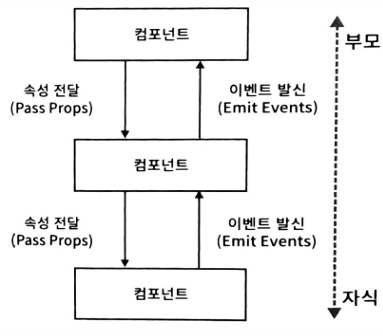
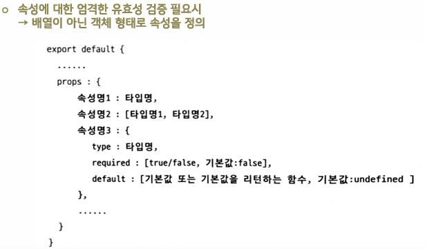

# component

## Day 015 - 2026-03-24

---

## 목차

1. VUE

## VUE

### VUE init

- vue는 single file componemt : .vue 파일 하나에 컴포넌트 하나(템플릿 + 스크립트 + 스타일)
- vite(비트) : npm init vue
- 살행 : npm run dev
- @ 기호를 src로 인식시켜 절대경로 사용(vite.config.js)(vscode에서 사용은 jsconfig.json)

### 컴포넌트

- 전역 컴포넌트 사용
  - main.js에 등록하여 사용
  - `import Component form './Compontent'`
  - `createApp(App)
.component('CheckboxItem', CheckboxItem)
.mount('#app');`
- 지역 컴포넌트 사용
  - component 옵션에 지정
  - ```
    <script>
       import CheckboxItem from './components/CheckboxItem.vue';
       export default {
       name: 'App',
       components: { CheckboxItem },
       };
    </script>
    ```

### 컴포넌트 정보 전달



```txt
부모 (Parent.vue)
   | props: message
  ↓
자식 (Child.vue)
  | $emit('notify', msg)
 ↑
부모 (Parent.vue)
```

#### 속성

- 자식 컴포넌트는 props 옵션으로 속성 정의
- 자식은 속성 못바꿈(read only), 부모가 변경하면 자식은 자동 렌더링
- 속성은 배열로 전달
  `props: ['name', 'checked']` `<CheckboxItem :name="idol.name" :checked="idol.checked"/>`
- 속성을 객체로 전달
  `props: ['idol']` `<CheckboxItem v-for="idol in idols" :key="idol.id" :idol="idol" />`

#### 속성의 유효성 검증



```VUE
export default {
  name: 'CheckboxItem',
  props: {
    id: [Number, String], // Number 또는 String 타입
    name: String,
    checked: {
    type: Boolean,
    required: false,
    default: false, // 생략시 기본 false
    },
  },
};
```

### 사용자 정의 이벤트

- 부모 컴포넌트는 v-bind를 이용해 자식 컴포넌트의 속성 정보를 전달
- 자식에서 발신, `$emit('이벤트명',[값])` 부모에서 수신: `v-on(@)`
- `$`가 붙으면 Vue 모델 자체의 메서드
- 'emits:[이벤트명]' : emits 내부에 정의되지 않거나 false를 return하는 emit은 경고 콘솔 출력함
  ` emits: {nameChanged: (e) => {return false}}` `emits:[nameChanged1]

```html
<template>
  <div style="border: solid 1x gray; padding: 5px">
    이름: <input type="text" v-model="name" />
    <button @click="$emit('nameChanged', { name })">이벤트 발신</button>
  </div>
</template>
<script>
  export default {
    name: 'InputName',
    data() {
      return { name: '' };
    },
  };
</script>
```

```html
<template>
  <div>
    <InputName @nameChanged="nameChangedHandler" />
    <br />
    <h3>App 데이터 : {{ parentName }}</h3>
  </div>
</template>
<script>
  import InputName from './components/InputName.vue';
  export default {
    name: 'App4',
    components: { InputName },
    data() {
      return {
        parentName: '',
      };
    },
    methods: {
      nameChangedHandler(e) {
        this.parentName = e.name;
      },
    },
  };
</script>
```

### 컴포넌트 분할 기준

1. 변경된 데이터만 렌더링
2. 재사용성
3. 복잡도(선택)

## 목차 2

## 정리

### 복습시 중점사항

1. 프로젝트 구조
   어디서 시작해서 가는지(index(거의 수정x)->main(라이브러리 사용시 변경됨)->App->하위 컴포넌트)
2. **Props** 사용법
3. emit 이벤트 처리 방법

### spa의 단점

- 검색엔진에 노출 안됨
- 검색엔진은 html 파트만 보기 때문

### 더 공부할 것

- [ ]

### 기억할 내용

> [!Warnning]
> error message: v-model cannot be used on a prop
> v-model은 props 안되나봄..

> [!TIP]
> nodel_modules는 폴더크기가 커서 보통 지움
> 어차피 package.json에 있어서 npm install 하면 됨
