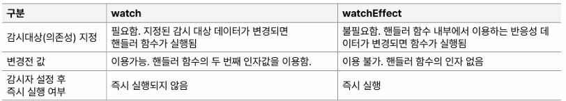

# compositionAPI

## Day 018 - 2026-03-27

---

## 목차

1. Composition API
2. vue-router 1

## Composition API

| Option API                            | Composition API |
| ------------------------------------- | --------------- |
| vue2                                  | vue3            |
| 옵션별 분리 (data, methods, computed) | 기능별 그룹화   |
| this 사용 O                           | this 사용 X     |
|                                       | setup() 사용    |

### ref()

- 기본타입의 참조형 데이터로 값이 바뀔때 자동 렌더링 되는 반응형 데이터
- data 옵션에 해당
- x.value로 접근해야 함(x 로 접근시 반응형 잃어버림)
- 객체 선언시 x.value.name 으로 접근하면 됨
- template에는 그냥 x로 적용

### reactive()

- ref 중 참조 데이터 타입에 대한 반응형 데이터(member를 갖는 참조형만 가능)로 ref 보다 작은 범위
- 객체, 배열 등 ref보다 쉽게 사용가능한 기능을 제공
- x.value.name 이 아닌 x.name으로 접근 가능

> [!TIP]
> 서버에서 객체(배열)을 받아 변경해야 하는 경우 1번처럼 선언
>
> (객체가 하나밖에 없더라도 멤버로 선언하는 이유)
>
> 2번의 경우 `todoList = new Arr;`는 반응성이 없어짐
>
> 1번의 경우는 `state.todoList = new Arr` 로 반응성 유지됨
>
> 1. const state = reactive({ todoList: [] });
> 2. const todoList = reactive([]);

### setup()

- 관심사를 모으는 용도, this를 사용하지 않도 됨
- `setup(a,b)` a: props, b: component context(ctx)(this 의미)
- this.emit이 아니라 ctx.emit('add-todo',todo) 사용하면 됨
- 클로져 처럼 바깥에서도 내부 변수를 사용할 수 있음

### computed()

- `import {computed} from 'vue'` `const 속성명 = compouted(()=>{})`

### watch()

- 반응형 데이터의 변화를 감지하는 기능
- `watch(data,(current,old)=>{})` :data에 ref, reactive값 가능
- data가 ref 인 경우 current,old는 ref.value값 이므로 current.value아닌 current 그대로 사용

### watchEffect()

- data가 reactive의 멤버인 경우
- 감시 대상을 지정하지 않음(모든 데이터 변화에 반응?)
- 여러 데이터의 반응을 감시해야 하는 경우watchEffect() 사용(_가끔 쓰임_)
- 페이지 이동, 데이터 로드 할때 쓰임

### 생명주기 훅(Life Cycle Hook)

### `<script setup>`

    - 스크립트 내용을 setup()함수로 넣어줌
    - setup을 만들 필요 없음
    - return 필요 없음
    - components 필요 없음(import만 하면 됨)
    - props, emit
        - import 없이 바로 사용 가능
        - const props = defineProps({
            todoItem: {type : Object, required:true}
            })
        - const emit = defineEmits(['delete-todo', 'toggle-completed']) : 이벤트 발신할때는 emit('delete-todo',id)
    - 단 template에서만 사용된다면 props, emit 선언 필요 없음(?)
    - 인라인으로 사용하는 경우에도 `%emit()` 아닌 `emit()` 바로 사용 가능

## 추가 학습

### 클로저 (Closure)

- 함수가 자신이 선언될 때의 환경(스코프)을 기억해서, 나중에 그 환경에 접근할 수 있는 기능
- 함수가 외부 함수의 변수에 계속 접근할 수 있는 것

## 정리

- 지금까지는 VUE2.. 드디어 VUE3 방법 들어간다

### 더 공부할 것

- [ ] 생명주기 훅(Life Cycle Hook) : 면접 준비

### 기억할 내용
