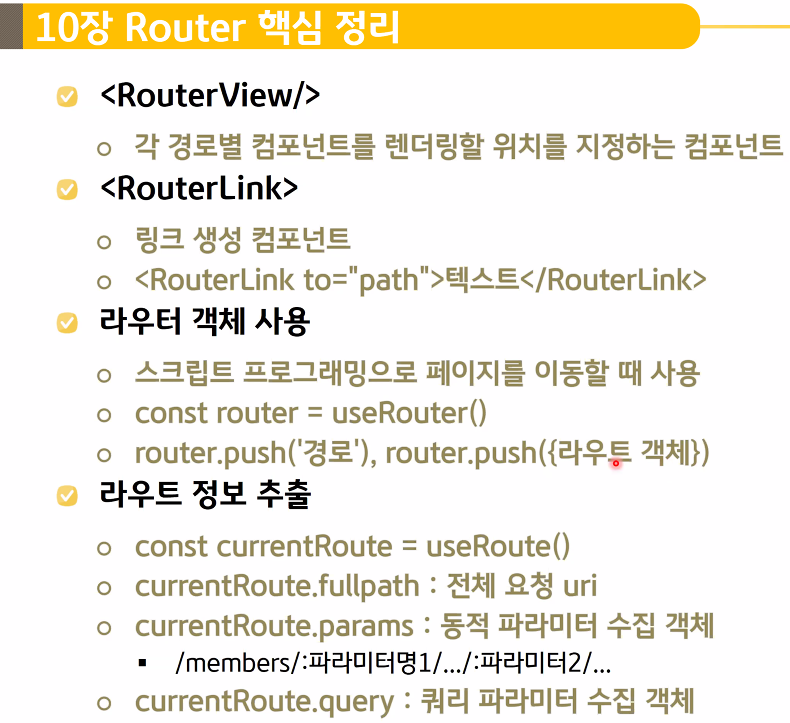
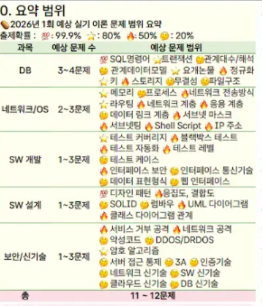
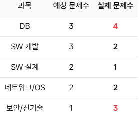
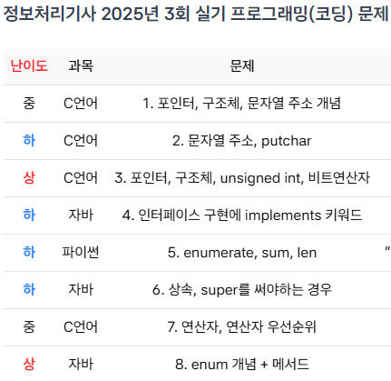

# axios

## Day 022 - 2026-04-02

---

## 목차

1. axios
2. Cross-Origin

## axios

### REST(Representational State Transfer) 서비스

- 클라이언트와 서버의 데이터 전송 약속
- 정보를 자원으로 간주하여 각 자원을 URI로 표현
- 자원에 대한 조작은 HTTP 메서드로 표현
- **URI와 HTTP 메소드를 이용해 객체화된 서비스에 접근하는 것**
- REST는 설계 원칙 자체, RESTful API 는 REST 원칙을 잘 지켜 만든 API

| Resoure   | Verb        | Representation |
| --------- | ----------- | -------------- |
| 자원, URI | HTTP 메서드 | JSON, XML      |

| GET  | POST           | PUT                 | PATCH    | DELETE |
| ---- | -------------- | ------------------- | -------- | ------ |
| 추출 | body 통해 생성 | body 통해 전체 수정 | 부분수정 | 삭제   |

### JSON-SERVER

-`npm install -g json-server` : -g는 전역설치(버전설정은 어려움)

```json
db.json
{ //json 파일은 {}객체로 시작해야해
  "todos": [
    {
      "id": "1",
      "todo": "야구장",
      "desc": "프로야구 경기도 봐야합니다.",
      "done": false
    },
    {
      "id": "2",
      "todo": "놀기",
      "desc": "노는 것도 중요합니다.",
      "done": false
    }
  ],
  "members":[
    {"id":"1",
    "name":"홍길동"},
    {"id":"2",
    "name":"임꺽정"}
  ]
}
```

### Thunder Client 확장팩(vs-code용)

- Postman과 유사함

### Talend API Tester 확장팩(크롬 용)

### Axios 라이브러리 사용법

- fetch를 편하게 쓰기 위한 라이브러리
- pormise 객체를 리턴 : .resolve, .rejoect
- `axios.get(url).then((response)=>{
    console.log('# 응답객체: ', response)
})`
- 직렬화 과정 필요 없음

#### axios.response 객체

| 속성   | 설명               |
| ------ | ------------------ |
| data   | 수신된 응답 데이터 |
| status | 응답 상태 코드     |

#### 헤더,바디 지정 방법

- header

```txt
axios.get(url, {
  timeout: 2000,
  headers: { Authorization: "Bearer xxxxxxx" }
});

```

- body
  `axios.post(url, data, config)`

#### proxy server

proxy 로 반환함

- 정규 표현식(/.../)

```txt
/^\/api/   →  정규표현식 패턴
^          →  문자열 시작
\/         →  / 문자 (슬래시는 특수문자라 \로 이스케이프)
api        →  그냥 문자열 api

전체 의미: "문자열 시작이 /api 면 → 빈 문자열로 교체"
```

```js
// vite.config.js에 추가해 사용
  server: {
    proxy: {
      '/api': {
        target: 'http://localhost:3000',
        changeOrigin: true,
        rewrite: (path) => path.replace(/^\/api/, ''),
      },
    },
  },
```

## Cross-Origin

- 다른 서버와의 작업시(다른 플랫폼) : 서버의 역할
- !!! CORS(cross origin resource sharing) 문제가 이거였음
- 프론트, 백을 같은 서버에 올릴 경우 통신이 가능하지만, 다른 서버와 통신시에 Cross-Orgin 문제가 생김

- 오리진(origin)
  - 현재 요청 페이지를 받은 서버의 정보(주소+포트번호)
  - `location.origin`

- 브라우저의 기본 보안 정책
  - 동일 근원 정책 (same origin policy)
  - 다른 오리진의 서버와 통신을 허용하지 않음

- 해결방법
  1. 백엔드 API 헤더에 `Access-Control-Allow-Origin:http://localhost:5173` 추가
     - `...-Origin:*` : 모든 접속 허용
     - `Access-Control-Allow-Methods`
     - `Access-Control-Max-Age:3600`
  2. 프록시를 이용힌 우회
  - vite.config.js에 server 항목
  -

## 정리

### 더 공부할 것

- [ ]

### 기억할 내용







```

```
