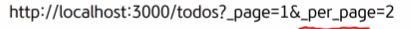
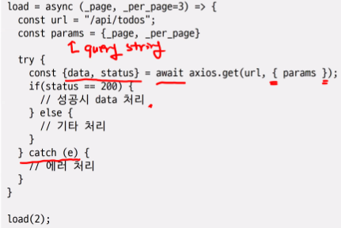

# axios+router

## Day 023 - 2026-04-03

---

## 목차

1. router 적용 todos 앱
2. 404 처리
3. provide-inject 통한 todos 데이터 관리 및 페이지 라우팅
4. josn-server와 axios를 통한 페이지 별 데이터 관리

## 목차 1

- 비즈니스 로직은 컴포넌트에 묶이지 않고, 독립적인 모듈로 작성(pinia)하는것이 좋음
- 혼자 사용하거나, 수정이 빈번하지 않는 경우: 서버 호출을 자주하지 않고, 프론트에서 직접 리스트에 푸쉬, 삭제, 업데이트 하여 서버호출 오버헤드를 줄임
- 같이 사용한다면 매번 목록을 새로 받으면 됨

## 지연 시간에 대한 스피너 UI

- vue-csspin

## 정리

### 더 공부할 것

- [ ] useRoute(), useRouter() 더 알아보기

### 기억할 내용

todoList = reactive([])
status = reactive([todoList:{}])

- 첫번째 코드 보다 두번째를 이용해 반응성을 유지

#### 전개 연산자

- `(...res.data)`

#### 페이지 별 호출 방법

