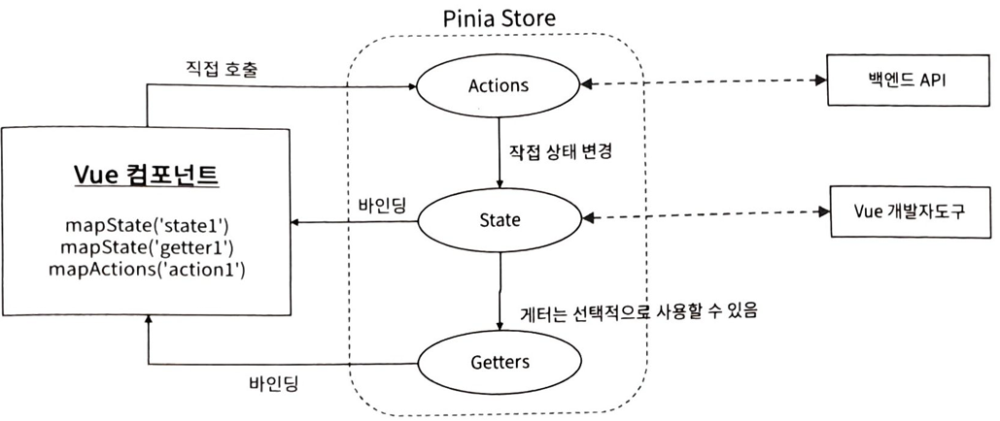

# pinia

## Day 024 - 2026-04-06

---

## 목차

1. pinia

## Pina

- 컴포넌트와 완전히 분리하여 컴포넌트처럼 사용
  

### 스토어 정의

- defineStore('스토어명',함수) : `useCounterStore`
- 함수 인자 :
  - 반응형 상태 정의
  - 계산된 상태 정의
  - 외부에서 사용할 항목을 객체로 리턴
- main.js
  - `import {createPinia} from 'pinia'`
  - `app.use(createPinia())`

- Composition API 방식
  - state = ref
  - getter = computed
    1. 의존성 추적 - 값이 바뀔때만 계산
    2. 캐싱 - 값이 안바뀌면 재사용
    3. 반응성 유지 - template 자동 업데이트
  - action = function

### 스토어 사용

- 스토어 import
- setup 에서 **반응성 있게** 연결
  - `const count = compurted(()=>store.cout);`
  - `const increment = store.increment;`
- 분해할당으로 사용
  - 액션함수는 정상 동작
  - 상태함수는 반응성 잃어버림 -> `storeToRefs(store)` 사용시 반응성 유지 가능

```js
import { ref, computed } from 'vue';
import { defineStore } from 'pinia';

export const useCounterStore = defineStore('counter', () => {
  const count = ref(0);
  const doubleCount = computed(() => count.value * 2);
  function increment() {
    count.value++;
  }

  return { count, doubleCount, increment }; // count처럼 변경 가능한 값을 직접 RETURN 하는것은 비권장. READ ONLY 로만 사용 권장
});
```

## Storage

- local storage, session storage

## 정리

- pinia 의 사용보다 어떤 상태를 전역으로 사용할지가 중요
  - 로그인 상태
  - 테마 상태
- 특정 기능인 todoList 같은 경우는 provide로 해도 되나
- pinia로 모듈화 하면 관리가 편함

### pinia 의 책임

- pinia내부에 api 호출되는 경우 : 단일책임원칙(SRP) 위반
- 수정이 되어야 할 경우 한가지 이유만으로 수정되도록
  -> 서버와의 통신은 src/api/todoApi 처럼 특정 엔드포인트와 통신하는 모듈 생성 권장

### 더 공부할 것

- [ ]

### 기억할 내용
