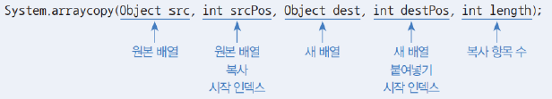

# variable

## Day 026 - 2026-04-15

---

## 목차

1. 변수와 타입
2. 조건문과 반복문
3. 참조 타입

## 변수와 타입

### 어제 학습한 내용이었음

## 조건문과 반복문

### 조건문

- `break`
- `continue`

### 반복문

- switch(value){
  case 1 ->10;
  case 2 ->20;
  default ->0
  }
- `case:` 대신 `case->`사용
  1. break 필요 없음
  2. 값을 반활 할 수 있음(표현식)
  3. yield는 블록 안에서 값을 반환할때 사용 (return 아닌 yield)

## 참조 타입

### 메모리

- 메모리 사용 영역
  - 메소드 : 바이트코드 파일을 읽는 내용이 저장 ( read only)
  - 힙: 객체가 생성되는 영역, 객체의 번지는 메소드영역과 스택 영역에서 참조
    - 가끔 쓰이므로 0으로 초기화 해줌
  - 스택: 메소드를 호출할때마다 생성되는 프레임을 저장
    - 초기화 과정 없음, 함수 호출이 빈번하므로 초기화가 성능저하 가능성 있음

- 비교 연산자
  - `==`, `!=` 참조 주소에 대한 비교 연산자
  - 실제 비교에는 함수를 사용 (equals)

- 멀티 스레드
  - 스레드 마다 스택 존재
  - 메소드, 힙 영역은 공통으로 존재

### garbage

- new & delete
  - JAVA는 garbateCollector 사용으로 delete 사용 안해도 됨
- 더이상 사용하지 않는 메모리 영역을 회수
  - 자바 가상 머신이 주기적으로 실행

### String 타입(참조타입)

- 불변 객체 : 생성 후 원본 수정 불가
- 아래의 경우 같은 힙 영역(주소)을 사용하므로 new를 사용해 영역을 분리할 수 있음
  - new는 힙영역에 생성하며 이름 부여 안됨(주소로 접근 가능)

```java
String name1 = '홍길동'
String name2 = '홍길동'
```

```java
String name1 = new String '홍길동'
String name2 = new String '홍길동'
```

- 문자 추출
  - charAt() 사용
  - str[0] 허용 안함 : 연산자 오버로딩을 지원 안함
- 문자열 길이 : str.length()
- 문자열 대체 : String new = oldStr.replace("자바","JAVA")
  - 원본 수정은 안되므로 새 문자열 반환
- 문자열 자르기 : str.subString(0,6)
  - 역시 원본 수정 안되므로 새 문자열 반환
- 문자열 찾기 : str.indexOf("자바")
- 문자열 분리 : str.split(",")
- 문자열 쿼리(T/F) : str.startWIth(), str.endWIth()

### Array 타입

- 배열 내부 엘리먼트의 타입이 고정됨
- 배열의 크기도 고정됨

- 선언
  - `int[] intArray = {1,2,3}`
  - `int [] intArray; intArray = new int[] {1,2,3}`
    - 선언과 동시에 초기화 하는것 아니면 new 해야 함
  - new 연산자로 배열 생성 ->

```java
public static void printItem(int[] scores){
    for(int i=0;i<3;i++){
        System.out.println("score[" + i + "]: " + i);
        System.out.printf("score[%d]%d",i,i)
    }
}
```

- 배열 길이: arr.length
  - 메서드 아닌 상수(배열 생성될때 자동 생성, readOnly)
- 베열의 복사(얕은 복사)
  - 선언, 복사 두 단계로 구현 가능
  - 

### 배열의 복사 (깊은 복사)

#### 다차원 배열

- String[][] names = new String[2][];

## 추가

### 더 공부할 것

- [ ] 메모리 흐름
- [ ] null, NullPointerException

### 기억할 내용

- 실제 어플리케이션에서 배열 거의 안씀
- 코딩테스트에 많이 나오고, 실무에서는 가변 데이터 성격상 리스트 많이 씀
- `break` : switch, for, while에만 사용
- 'return' : 함수(메서드)
- 싱글톤 : 디비와 연결되는 객체는 하나의 (new)로 생성해서 사용
