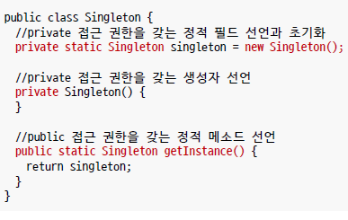

# extends
## Day 028 - 2026-04-17

---
## 목차
1. 싱글톤
2. 상속
3. 다형성
## 싱글톤(singleton)
- 객체를 하나만 생성해 사용하는 방식
- enumerate(enum) 방식은 싱글톤 방식임
- 초기화는 각각 
  - 부모는 부모의 것 초기화, 자식은 자식의 것 초기화
  - 부모 먼저 초기화



```java
public class Singleton {
    //생성자 접근 제한
    private Singleton(){}
    //객체 생성(한번만 생성후 이후 이 객체만 사용)
    private static Singleton singleton = new Singleton();
    //이 객체를 쓸수 있는 public 함수
    public static Singleton getInstance(){
        return singleton;
    }
}
```

## 상속
- 부모 클래스의 필드와 메소드를 물려주는 것
- `extends`
- 다중 상속 허용 안함

### 부모 생성자 호출
- 부모 = parent = super()
- 자식 객체를 생성하면 부모 객체가 **먼저** 생성됨

### 메소드 오버라이딩
- 부모 메소드명,타입,리턴타입 동일해야 함
- 접근제한을 강하게 할 수 없음(public -> private 변경 불가)
- 새로운 예외를 throws 할 수 없음
- 메소드 내부에 super.method() 사용하여 부모 메서드 호출 가능
- 단축키 `alt+insert` or `ctrl+o`

```java
@Override
void method(){
    super.method();
    // 추가 작업 처리 내용
}
```
### final
- final 클래스: 부모 클래스가 될 수 없음
- final 메소드: 오버라이드 할 수 없음

## 다형성

### 자동타입 변환
- upcast
- 자식타입객체 -> 부모타입 변수
- `Cat cat = new Cat()`
- `Animal animal = cat;` or `Animal animal = new Cat();`
- 반대는 불가능 `Cat animal = new Animal` 불가능 
- downcast 안됨(가능한 경우도 있지만 개발자가 책임)
- 메서드의 경우 오버라이딩 된 자식의 메서드가 호출 됨
- 실체 기준으로 정해짐(실체는 자식)

### 다형성
- 사용 방법은 동일하지만 실행 결과는 다양하게 나오는 성질
- 다형성을 구현하기 위해서는 자동 타입 변환과 메소드 재정의가 필요
- 실체는 자식, 타입(모양)은 부모로 생성하여 실체만 바꿔낄 수 있도록 함

#### 필드의 다형성
- 필드 타입은 동일하지만, 대입되는 객체가 달라져서 실행 결과가 다양하게 나올수 있음

#### 매개변수의 다형성
- 동일한 타입의 자식 객체를 제공 할 수 있음
- 어떤 자식 객체가 제공되었느냐에 따라 메소드 실행 결과가 달라짐(**전략 strategy 패턴**)

#### Open-Close 원칙
- 가장 대표 패턴이 상속을 이용한 전략패턴
- if, else로 바꾸는것이 아니라 다형성을 통해 구분(호출부 변화 닫힘)
- 자식 클래스의 종류에 의해 확장

## 정리
- 부모의 역할은 형태(모양)을 잡는 것
- 자식은 실제 할일을 정의하는 것
> 부모타입으로 프로그래밍 해라
> 타입은 부모로 지정하는 것이 좋음