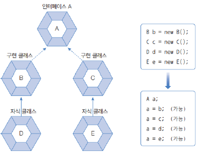

# interface
## Day 029 - 2026-04-20

---
## 목차
1. 다형성
2. 인터페이스
3. 인터페이스를 이용한 다형성

## 다형성
### 객체 타입 확인
- instanceof 연산자
- `(자바>12) if(parent instaceof Child child)`
  - 인스턴스 맞다면 if문 내에서 타입 변환
### 추상 클래스
- 실체 클래스의 부모 역할
- 공통적인 필드나 메소드 물려받을 수 있음
- 행동이 다 다르므로 실제 코드는 공유하지 않음
- 카테고리를 정하는 역할
- new로 인스턴스 생성 불가 : 부모 클래스로만 사용
- `abstract` 키워드 사용 
```java
public abstract class Phone{
    //기본 필드, 생성자, 메서드 ..
    public abstract void sound(); //추상 메서드
}
public class SmartPhone extends Phone{
    // 기본 생성자, 메소드 ..
    
}

// new Phone() 불가, 자식으로만 생성 가능
SmartPhone smartPhone = new SmartPhone();
```
## 인터페이스
### 인터페이스 역할
- 코드 재사용에는 관심 없음
- 다형성 구현에 주된 기술

### 인터페이스 선언
```java
// 인터페이스
public interface A{
    // public 필드, 추상메소드, 디폴트메소드, 정적 메소드
    // private 메소드, 정적 메소드
}
// 구현 클래스
public class B implements A {}
```
### 인스턴스 멤버
#### 상수 필드
- `[public static final] 타입 상수명 = 값;`
- 인스턴스의 필드는 모두 상수이므로 생략 가능
- 대문자 + '_' 사용이 관례
#### 추상 메소드
- 리턴타입, 메소드명, 매개변수만 기술
- 중괄호{} 없음
- `public abstract` 생략 가능
#### 디폴트 메소드
- 완전한 실행 코드를 갖는 디폴드 메소드 선언 가능
- 공통 기능을 구현할 수 있도록 함
- java 8 이후 생긴 기능
- collection을 stream 해야 할 기능이 필요해짐
- 오버라이딩도 가능함
#### 정적 메소드
- 인스턴스와 무관한 역할을 하는 static 메서드
#### private 메서드
- 구현 객체가 필요한 메소드(구현 객체 내부 사용)
### 다중 인터페이스
- 여러 부모를 선언할 때 부모의 네이밍 충돌이 발생할 수 있음
- 디폴트 메서드 최소화 하여 충동 예방 ( 추상메서드는 충돌 x )
- SRP로 역할을 최소화
- ISP(Interface Segregation Principle) : 인터페이스 분리의 원칙(SRP 기준으로)
- able (할 수 있다) 라는 접미어를 많이 붙임
### 인터페이스 상속
- 인터페이스도 인터페이스를 상속 가능 (extends)
- 인터페이스 구현 클래스에는 Imp을 붙이는 관례(구현클래스가 하나인 경우)
- 부모 클래스가 인터페이스를 구현하고 있다면 자식 클래스도 인터페이스 타입으로 자동 타입 변환 될 수 있음
### 타입 변환
자동타입변환

강제타입변환

## 인터페이스를 이용한 다형성

### 결합
| 구분        | 강결합        | 약결합 (DI)              |
|-----------|------------|-----------------------|
| 의존성 생성    | 내부에서 `new` | 외부에서 주입               |
| 의존 대상     | 구체 클래스     | 인터페이스                 |
| 교체 방법     | 코드 수정      | 주입 객체만 교체             |
| 테스트       | Mock 불가    | Mock 주입 가능            |
| Spring 연관 | 해당 없음      | `@Autowired`, `@Bean` |

### 매개변수의 다형성
- 매개변수 타입을 인스턴스로 선언
- 메소드 호출시 다양한 구현 객체 대입 가능
```java
public class Driver {

  void drive(Vehicle vehicle) {
    vehicle.run();
  }

  public static void main(String[] args) {
    Driver driver = new Driver();
    int num = 1;
    Vehicle[] cars = {new Taxi(), new Bus()};
    driver.drive(cars[num - 1]); // 운영부 수정 할 필요 없음 -> OCP 원칙
  }
}
```
## 정리
- 인터페이스의 추상메서드로 대부분 사용
- 운영을 인터페이스타입으로 하여 OCP 지킬 수 있음 
- Programming to Interface : 인터페이스로 프로그래밍 해라
- 인터페이스에 의존할 수록 코드가 유연해짐
- 상속 VS 인터페이스 : 보통은 인터페이스 ( 상속은 경험이 쌓여야 )를 통한 다형성 구현

-  POJO (Plain Old Java Object) 
  - 필드, 게터, 세터의 기본 형식
### 기억할 내용
