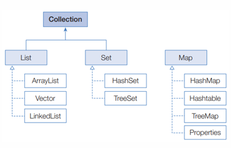

# generic
## Day 034 - 2026-04-27

---
## 목차
1. generic
2. Collection
## generic
- 결정되지 않은 타입을 파라미터로 처리
- 실제 사용할 때 파라미터를 구체적인 타입으로 대체시키는 기능
- `<T>` 는 T 타입 파라미터 
> [TIPS] 
> 대문자 한글자로 사용하는 것이 관례
```java
public class Box<T>{
    public T content;
}

Box<Integer> box = new Box<Integer>();
int content = box.content;
```
```java
public class Product<K, M> { // 타입파라미터로K와M 정의
    //타입파라미터를필드타입으로사용
    private K kind;
    private M model;
    //타입파라미터를리턴타입과매개변수타입으로사용
    public K getKind() { return this.kind; }
    public M getModel() { return this.model; }
    public void setKind(K kind) { this.kind = kind; }
    public void setModel(M model) { this.model = model; }
}
```
### 제한된 타입 파라미터
- 특정 타입이나 구현, 상속 관계로 제한하는 경우 사옹
- `public <T extends 상위타입> 리턴타입 메소드(매개변수,..){}`

### 와일드 카드
- 제네릭 타입 사용할 때 모든 타입을 사용 할수 있는 타입
- `<?>` 로 표현

## 컬렉션 자료구조

### List
- 인덱스로 관리
- `add(E,element)`, `add(int index, E e)`, `set(int index, E e)`
- `contains(Object o)`, `get(int index)`, `isEmpty()`, `size()`
- `clear()`, `remove(int index)`, `remove(Object o)`

#### Arraylist
`List<String> list = new ArrayList<>();`
- 제한 없이 객체 추가 가능
- 검색 빠름
- 삽입, 삭제 느림
- 배열의 크기에 대해 동적으로 크기 조정함
  - 배열 확장 시 두배 확장
  - 배열 축소 시
#### Vector
- 지금 사용되지 않음
#### LinkedList
- value, index, prev, next 의 값을 갖음
- 추가, 삭제 빠름
- 검색 느림
### Set
- 순서 유지 안됨
- 객체 중복 저장 안됨
- `add(e e)`,`contain(Object o)`
- `isEmpty()`, `iterator<E> iterator()`, `size()`
- `clear()`, `remove(Object o)`
#### HashSet
- 다른 객체라도 hasCode() 같고, equals() 같으면 저장 안함
- *iterator()*
  - 반복자를 얻어 Set 컬랙션의 객체를 하나씩 가져옴
  - `hasNext()` : 가져올 객체가 있으면 true
  - `next()` : 컬랙션 객체 가져옴
  - `remove()` : next로 가져온 객체를 제거
```java
Set<E> set = new HashSet<>();
Iterator<E> iterator = set.iterator();
```
#### LinkedHashSet
- 순서가 보장되는 set
### Map
- 키와 값으로 구성된 엔트리 객체 저장(python의 dictionary)
- `V put(K key, V Value)`
- `containsKey(Object key)`, `containsValue(Object value)`
- `Set<Map.Entry<K,V>> entrySet()` : 순회하기 위함
- `get(Object key)`, `Set<K> keySet()`, `size()`, `Collection<V> values()`(읽기 전용)
- `clear()`, `remove(Object key)`
#### HashMap
`Map<String, Integer> map = new HashMap<>();`
#### Properties
- 일종의 map(키, 값)
- key, value 모두 String으로 타입 고정
- 설정 정보, 코드와 무관한 정보 (하드코딩 안하는 내용)
- .properties로 작성해, `load`로 읽어와 사용

  .```properties
#띄어쓰기도 인식 하므로 띄어쓰기 없이 저장해야 함
driver=oracle.jdbc.Oracledirver
url=jdbc...
username=scott..
```


|               | 장점                  | 단점          | 삽입/삭제    | 검색       |
|---------------|---------------------|-------------|----------|----------|
| ArrayList     | 검색 빠름               | 중간 삽입/삭제 느림 | O(n)     | O(1)     |
| LinkedList    | 삽입/삭제 빠름            | 검색 느림       | O(1)     | O(n)     |
| HashSet       | 중복 제거               | 순서 보장 없음    | O(1)     | O(1)     |
| LinkedHashSet | 중복 제거, 순서 보장        | 추가 메모리 오버헤드 | O(1)     | O(1)     |
| HashMap       | key-value 저장        | 순서 보장 없음    | O(1)     | O(1)     |
| LinkedHashMap | key-value 저장, 순서 보장 | 추가 메모리 오버헤드 | O(1)     | O(1)     |

### Set, Map의 순회
- 향상된 for 문 사용하면 됨
  - `for (String s : set){}`
  - `for (String key : map.keySet()){}`
  - `for (int value: map.values()){}`
- forEach + 람다 가능
  - `map.foreach((k,v) -> sout(k,v));`

## 추가 학습
### 테스트 데이터 
- `List<String> list = List.of("test1","test2","test3");`
- add 사용하지 않고 리스트 생성 가능
- read only 리스트
### 생성 관례
- `List<String> list = new ArrayList<String>();`
- `List<String> list = new ArrayList<>();`: 생성 타입 생략(자동 추론), 권장

## 정리

### 더 공부할 것

- [ ]

### 기억할 내용
