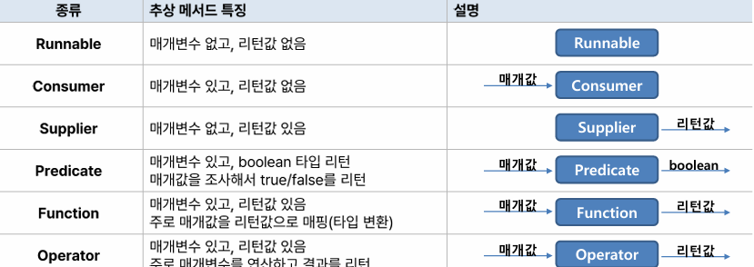

# lambda
## Day 036 - 2026-04-29

---
## 목차
1. 람다
2. 커맨드 패턴
3. 스트림
## 람다
### 람다의 개념
- 자바의 기본 개념 : 클래스로 개발해라 
- 함수형 프로그래밍 스타일을 자바에 도입한 것
- 하나의 추상 메서드를 가진 인터페이스 (함수형 인터페이스,`@FunctionalInterface`)
- 인터페이스의 구현체를 클래스 or 익명클래스가 아닌 간단하게 표현하는 방법
- 익명 inner 클래스에서 new를 제거해 줄인 방법
- 화살표 함수처럼 사용 가능하며 타입 추론하므로 타입 명시 안해도 됨
  - `var` : 구체 타입 대신에 var 사용해서 자동 추론 가능(생략 가능)
  - `for(var o : list)` 처럼 향상된 포문 사용 가능(생략 가능)
### 메서드 참조( 축약 표현 )
- 메서드를 참조해 람다식에서 불필요한 매개변수를 제거
- 람다식을 더 줄인 표현
- 값을 return 하는것이 아니라 함수형 인터페이스의 객체를 생성하는 표현식
- `(left,right)->Math.max(left,right)` -> `Math :: max;`
#### 정적 메서드(static) 참조
- `클래스 :: 스태틱메서드`
#### 인스턴스 메서드 참조시 
- `참조변수(인스턴스) :: 메서드`
#### 매개변수의 인스턴스 메소드 참조
- `(a,b) -> {a.instanceMethod(b);}` -> `클래스 :: instanceMethod`
- 첫번째 인자 : 인스턴스 , 두번째 인자: 매개변수
 ```java
    (a,b) -> a.compareTo(b)
    String :: compareTo
```
### 생성자 참조
- `(a,b)->{return new 클래스(a,b)` -> `클래스 :: new `
```java
Member m1 = person.getMember1(Memer::new);

Member m2 = person.getMember2(Member::new);

```
### 자바 8부터 표준 API로 제공되는 함수적 인터페이스

- 매개변수 3개 이상은 직접 만들어야 함

| 함수적 인터페이스 | 메소드      |
|-----------|----------|
| Runnable  | run()    |
| Consumer  | accept() |
| Supplier  | get()    |
| Preicate  | test()   |
| Function  | apply()  |
| Operator  | apply()  |


## Command 패턴
- **src.command 참조**

##  스트림 요소 처리
- 흐름, 데이터, 동작
- `Stream<String> stream = list.stream()`
- `for(var item : list){}` -> `stream.forEach(item -> {}));`
- Consumer인터페이스의 구현체(매개변수 0, return X)
- stream과 iterator 차이
  - 내부 반복자이므로 처리속도가 빠르고 병렬처리에 효율적
  - 람다식으로 다양한 요소 처리를 정의
  - 파이프 라인을 형성
```java
Stream<String> stream = set.stream();
stream.forEach(name -> System.out.println(name)) // -> System.out :: println
```
### 스트림 파이프라인
- 컬렉션의 오리지널 스트림 뒤에 필터링 중간, 매핑 중간 스트림이 연결될 수 있음
- 중간 작업의 결과물이 다음 작업의 결과물로 연결됨
- 중간 작업은 여러개 가능(return 있어야 함)
- 최종 처리는 return 없으며 하나만 존재 (ex. forEach())
- 최종 처리를 했을때만 데이터가 흐름 : 중간과정에서는 데이터가 흐르지 않음
- 중간처리를 메서드 체이닝을 통해 연결
```java
double avg = list.stream()
        .mapToInt(student -> student.getScore()) // .mapToInt(student::getScore)
        .average()
        .getAsDouble();
```
| 리턴타입        | 메소드                 | 소스        |
|-------------|---------------------|-----------|
| `Stream<T>` | Collection.stream() | List, Set |
| `Strem<T>`  | Arrays.stream(T[])  | 배열        |
## 정리

### 더 공부할 것

- List.of()
- Arrays.asList()

### 기억할 내용
