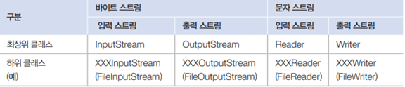

# stream
## Day 037 - 2026-04-30

---
## 목차
1. 스트림 요소 처리
2. 데이터 입출력

## 스트림 요소 처리
### 스트림 얻기
- 컬랙션
  - `java.util.Collection.stream()`
- 배열
  - `Arrays.stream(t[])`
- 범위
  - `IntStream.range(int int)`

- 순수 함수 : 같은 입력에는 같은 결과

### 필터링
| 메서드                    | 설명                       |
|------------------------|--------------------------|
| `distinct()`           | 중복 제거                    |
| `filter(Predicate<T>)` | predicate가 true인 요소만 필터링 |

### 매핑
- 스트림의 요소를 다른 요소로 변환
- mapXxx()

| 메서드                            | 요소->반환요소       |
|--------------------------------|----------------|
| `map(Function<T,R>)`           | `T->R`         |
| `flatMap(Function<T,Strem<R>>` | `T->Stream<T>` |

### 정렬
| 메서드                                 | 설명                                 |
|-------------------------------------|------------------------------------|
| `sorted()`                          | Comparable요소를 정렬한 새로운 스트림 생성       |
| `sorted(Comparator<T>)`             | 요소를 Comparator에 따라 정렬한 새 스트림 생성    |
| `sorted(Comparator.reverseOrder())` | reverseOrder가 람다함수 return해 내림차순 정렬 |

### 루핑, 매치
- 루핑: 스트림에서 요소를 하나씩 반복해서 가져와 처리하는 것
- 매치 : 요소들이 특정 조건에 만족하는지를 조사 (bool return)

| 메서드                                 | 설명                |
|-------------------------------------|-------------------|
| `peek(Consumer<? super T>)`         | T 반복              |
| `forEach(Consumer<? superT> action` | T 반복              |
| `allMatch(Predicate<T> predicate)`  | 모든 요소가 만족하는지      |
| `anyMatch(Predicate<T> predicate)`  | 최소한 하나의 요소가 만족하는지 |

### 최종처리 (집계)
- 최종처리 기능으로 요소들을 처리해 카운팅, 합, 평균 등 하나의 값으로 산출

| 리턴 타입               | 메서드                | 설명     | 예시                           |
|---------------------|--------------------|--------|------------------------------|
| `long`              | count()            | 요소 개수  |
| `OptionalXXX`       | findFirst()        | 첫번째 요소 |
| `Optional<T>`       | max(Comparator<T>) | 최대 요소  |
| `Optional<T>`       | min(Comparator<T>) | 최소 요소  |
| `OptionalDouble`    | average()          | 요소 평균  |
| `int, long, double` | sum()              | 요소 총합  |
| `Optional<T>`       | reduce()           | 커스텀 집계 | `strem.reduce(0,(a,b)->a+b); |

#### Optional 클래스
- 값이 없으면 디폴트 값을 설정하거나 값을 처리하는 Consumer를 등록

### 최종 처리 (요소 수집)
- 필터링 또는 매핑되 뇽소들을 새로운 컬렉션에 수집하고 컬렉션을 리턴
- `collect(Collector<T,A,R> collector)`
  - T : 요소
  - A : 누적기
  - R : 요소가 저장될 컬렉선(리턴타입)

| 메소드      | 설명                                  | 예시                             |
|----------|-------------------------------------|--------------------------------|
| toList() | T 를 List에 저장                        | .collect(Collectors.toList()); |
| toSet()  | T를 Set에 저장                          |                                |
| toMap()  | T를 K와 U로 매핑하여 K를 키로, U를 값으로 Map에 저장 |                                |

## 입출력 스트림
- 프로그램이 다른 프로그램과 데이터를 교환하려면 양쪽 모두 입력 스트림과 출력 스트림이 필요

### 파일 입출력 예외처리
- try(resource)로 처리하여 resource 종료시 자동 close
- `try(OutputStream os = new FileOutputStream("C:temp/test1.db")`

- ...ㅎㅎ

## 정리

### 더 공부할 것

- [ ]

### 기억할 내용
- 백엔드 비동기 방식에서 Stream은 필수
- 비동기 방식의 백엔드 : 리액티브 웹이라고 부름
- 우리가 배우는 스프링은 동기 방식임