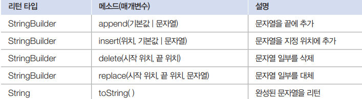

# thread
## Day 032 - 2026-04-23

---
## 목차
1. 지난시간 정리
2. java.base
3. 멀티 스레드
## 지난시간 정리
1. 예외처리
    - 예외 떠넘기기 : throws -> 예외처리를 호출자에게 넘김
    - 예외 넘기기 : new throw -> 강제 예외 발생
2. java.base 모듈
   - Object
     - `equals()`
     - `hashCode()` : 다른 참조가 같은 값이 될수도, 같은 참조 다른 값일수 있음
       - `equals()`, `hashCode()` 보통 같이 쓰임
     - `toString()`
       - python 의 `__str__()`
   - record 클래스명(필드 목록, ...) {} -> 보통 DTO 역할을 함 
   - Lombok 라이블러리
     - @NoArgsConstructor @AllArgsConstructor, @RequiredArgsConstructor(final, @NatNull)
     - @Getter, @Setter, @ToString
     - @Data, @Builder(다음에 소개..?)
   - System
     - in, out, err(catch절에 사용)
     - .exit(status)(0이면 정상 종료), .currentTimeMills(), nanoTime()
## java.base 모듈
### 문자열
String 클래스: 문자열을 저장하고 조작할 때 사용 

| 클래스              | 설명                       |
|------------------|--------------------------|
| String           | 문자열을 저장하고 조작할 때 사용       |
| StringBuilder    | 효율적인 문자열 조작 기능이 필요할 때 사용 |
| StringTockenizer | 구분자로 연결된 문자열을 분리 할 떄 사용  |
#### String 클래스
- 리터럴은 자동으로 String객체 생성
- String의 다양한 생성자 사용으로 직접 객체생성 가능
#### StringBuilder 클래스
- 메서드 체이닝 가능
- 잦은 문자열 변경 작업을 해야 한다면 String보다 StringBuilder
- StringBuilder는 내부 버퍼에 문자열 저장하고, 조작하도록 설계


```java
public class StringBuilderExample {
    public static void main(String[] args ) {
        String data = new StringBuilder()
            .append("DEF")
            .insert(0, "ABC")
            .delete(3, 4)
            .toString();
        System.out.println(data);
    }
}
```
### 래퍼 클래스 (포장 클래스)
- 기본타입(byte, char, int..)의 값을 갖는 객체
- 박싱 기능 : 기본 타입을 래퍼 클래스로 만들 수 있음 `Integer obj = 100`
- 언박싱 : 박싱의 반대 `int value = obj`, 연산시 자동 Unboxing
- 래퍼 자체의 기능보다 **제너릭**을 위해 사용됨

### Math 클래스(수학 클래스)
- `abs`, `ceil`: 올림값, `floor`: 버림값, `max`, `min`, `round`, `random`
- `Random()`: 개발시, `Random(long seed)`: 운영시
- `nextBoolean()`, `nextInt()`, `nextInt(int n)` : 난수 리턴

### 날짜와 시간
- `Date`, `Calendar`, `LocaldateTime`: 날짜와 시간 조작 가능(Date의 확장)

### 형식 클래스
- `SimpleDataFormat`:많이 사용됨, 날짜를 문자열로 포멧 `DecimalFormat`: 숫자를문자열로
  - `SDT sdt = new SimpleDataFormat("yyyy년 MM월 dd일")`
  - `sdt.format(new Date())`
    
### 리플렉션 : 원리를 통해 스프링 동작 이해 가능
- 일반 어플리케이션에서는 잘 사용되지 않으나 프레임워크, 라이브러리 개발시 많이 사용 됨
- Class 객체로 클래스와 인터페이스의 메타 정보를 읽고 수정하는 것
- Class 정보 얻는 방법
  1. Class clazz = 클래스이름.class; (Static), 개발할때(클래스 네임 알때)
  2. Class clazz = Class.forName("패키지..클래스이름"), 입력 등으로 찾을때 : 클래스가 메모리에 있어야 함(Method area) -> loading 기능 있음
  3. Class clazz = 객체참조변수.getClass(); 인스턴스를 통해 
- clazz로 멤버 정보 얻기
  1. 패키지와 타입 정보 얻기
     - `getName()`,`getsimpleName()`, `getPackage()` 
  2. 멤버 정보 얻기(생성자, 필드, 메서드)
     - `Constructor[]getDeclaredConstructors()`
  3. 리소스 경로 얻기
     - `getResource(String name)`, `InputStream getResourceAsStream(String name)`
     - class Path: 별도의 가상 경로
### 어노테이션 : 직접 구현하기 보다 원리를 이해
- 일반 어플리케이션에서는 잘 사용되지 않으나 프레임워크, 라이브러리 개발시 많이 사용 됨
- @로 작성되는 요소. 컴파일하거나 실행할때 처리를 알려줌
1. 컴파일 시 사용하는 정보 
   - `@override`
2. 빌드 툴이 사용하는 정보
   - `@Lombok`
3. 실행시
   - Spring에서 자주 사용
- 어노테이션 정의(생성)
```java
public @interface AnnotationName{
    String value(); //기본값이 없으므로 필수 속성이 됨
    int prop2() default 1; // 기본값이 지정, 생략 가능
}
@AnnotationName("값") // 단독 value 일 경우 속성명 생략 가능
@AnnotationName(value = "값")
@AnnotationName(value = "값", prop2(3))
```
- 어노테이션 적용 대상
- `@Target` 을 이용해 적용 대상 지정 가능
- `@Retention` 이용해 적용 단계 지정 가능

```java
import java.lang.annotation.ElementType;
import java.lang.annotation.RetentionPolicy;

// TYPE(클래스), 필드 앞에 붙일 수 있음
@Target({ElementType.TYPE, ElementType.FIELD})
// SOURCE: 컴파일할 때 적용, CLASS: 메모리 로딩할 때, RUNTIME: 실행할 때
@Retention(RetentionPolicy.RUNTIME)
public @interface AnnotationName {
}
```
## 멀티 스레드
### 스레드 개념
- 프로세스 : 운영체제는 실행중인 프로그램을 관리
- 멀티 태스킹 : 두가지 이상의 작업을 동시에 처리
- 스레드 : 코드의 실행 흐름 (CPU 스케줄링 단위)
- 멀티 스레드 : 두 개의 코드 실행 흐름
- 멀티 프로세스 : 프로그램 단위의 멀티 태스킹 / 프로그램 내부에서의 멀티 태스킹
- **메인 스레드**
  - main()메소드의 첫 코드부터 순차적으로 실행
  - 마지막 코드 or return 만나면 종료됨
  - 추가 작업 스레드들을 만들어 실행시킬 수 있음
  - 메인스레드가 종료되더라도 작업스레드가 실행주이면 프로세스 종료 안됨
### 스레드 생성 방법
1. Thread 클래스 직정 생성
   - 재사용성 높음. 일반적으로 권장 됨
2. Thread 자식 클래스로 생성
   - 멤버, 메서드 등 갖으며 복잡한 경우
```java
// Runnable 구현 방법 (주입)
Runnable task = new Task();
Thread thread = new Thread(task);
// Runnable의 익명객체 주입 방법 (주입)
Thread thread = new Thread(new Runnable() {
    @Override
    public void run() {
        // 스레드가 실행할 코드
    }
})
// Thread 자식 클래스로 생성 ( 주입 x )
Public class WorkerThread extends Thread{
    @Override
    public void run(){
    // 스레드가 실행할 코드
    }
}

```
### 멀티스레드의 문제점 및 해결 방안

## 정리

### 더 공부할 것

- [ ]

### 기억할 내용
