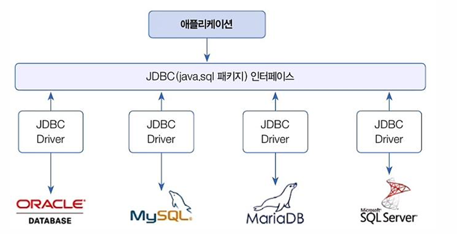
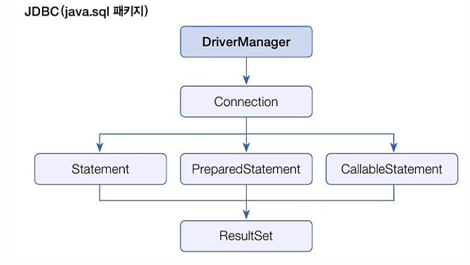

# jdbc

## Day 054 - 2026-05-29

---

## 목차

1. JDBC
2. JUnit5

## JDBC



- DMBS 상관없이 동일하게 사용할 수 있도록 클래스와 인터페이스로 구성
- 리스코프치환 법칙



### statement

- SQL 문 실행 클래스
- Connection객체를 통해 생성
  - `Statement stmt = conn.createStatement();
- SQL 실행 메서드
  - `ResultSet excuteQuery(SQL문)` : select문 실행
  - `int executeUpdate(SQL문)` : insert, update, delete문 실행

| Statement                             | PreparedStatement                                    |
| ------------------------------------- | ---------------------------------------------------- |
| 분석스케줄링, 실행을 반복             | 같은 쿼리에서는 분석 한번만, 대신 파라미터 바꿔 실행 |
| 단순함(파라미터 없는 경우 사용하기도) | 대부분 사용 (파라미터 처리되어 편함)                 |

- 대부분 PreparedStatement 사용함

## JUnit5

### @Test

- src 와 똑같은 구조로 Test 폴더 구조 생성
- 클래스명에 Test접미어 붙여 사용
- `@DisplayName` 생략 가능하나 요즘 사용 권장됨
- 예외처리를 직접하지 않고, Throws 사용
- 단위테스트는 메소드간 영향이 미치면 안됨.
  - @Test 인스턴스가 매번 새로 만들어지고, 삭제되고 반복됨
  - `@BeforeAll`, `@BeforeEach`, `@AfterAll`, `@AfterEach`

### Assertions

- 여러가지 단정문 static 메서드 제공
- assertEquals(실제값, 기대값)
  - 실제와 기대가 다르면 실패 -> 예외 발생

### AssrtJ

- 여러가지 단정문을 제공
- `isEqualTo()`, `contains()`, `startWith()` 등

## 정리

### 더 공부할 것

- [ ] Assertions, assertJ의 비교
- [ ] mvn library의 annotation, testcompile only 등의 명령어 존재 or 직접 입력
- [ ] Statement, PreparedStatement
- [ ] try 의 자동 닫기 : try-with-resources

### 기억할 내용

- Connection 객체 싱글톤으로 사용시 : 여러 사용자가 같은 Connection 접근 할 때 충돌/대기 문제 생길 수 있음
- 싱글톤패턴 적용 안하면, 여러개의 Connection 사용하는데, MySQL은 최대 151개의 동시 접속만 허용함
- 실무에서 싱글톤 + Connection pool 사용함 ( spring에서는 HikariCP)

```txt
사용자 A → Connection 1 ─┐
사용자 B → Connection 2 ─┤→ DB
사용자 C → Connection 3 ─┘
```
