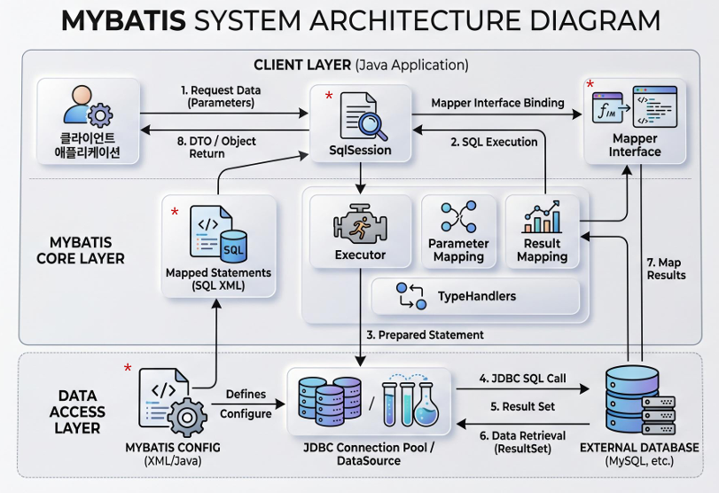

# MyBatis

## Day 056 - 2026-06-02

---

## 목차

1. Bulder 패턴
2. MyBatis

## Builder 패턴

1. 생성자의 문제점
   - 객체를 생성할 때 생성자의 필드가 많아지면 public 생성자의 매개변수도 늘어남
   - 어떤 값이 어떤 변수에 들어가는지 순서가 헷갈릴 수 있음
   - `new User("홍길동", 20, "서울", "010-1234-5678", "test@email.com");`
   - 코드를 보면중간의 숫자와 문자열들이 정확히 무엇을 의미하는지 한눈에 알기 어렵
   - 생성자를 여러개 만들어야 하거나 setName 등 호출 코드가 길어질 수 있음

2. 빌더 패턴의 작동 원리
   - 빌더 패턴은 객체를 직접 생성하는 대신 내부의 Builder 라는 도우미 클래스를 거쳐서 단계별로 값을 입력받은 후 최종적으로 build()메서드를 호출해 객체를 완성한다

3. 메서드 체이닝(Method Chaining)
   - 점(.)으로 계속 연결해서 코드를 작성하는 방식을 메서드 체이닝이라고 하며 빌더 패턴의 핵심 가독성 포인트이다

4. 객체의 '불변성' 유지
   - 매개변수가 많아져도 어떤자리에 어떤값이 들어가는지 명확히 보임
   - 멀티스래드 환경에서 안전
   - final 키워드를 사용한다

## MyBatisd

- 자바와 독립적으로 데이터 접근
  - .java파일에 SQL 사용하던 부분을 xml 파일로 사용
  - xml은 컴파일 필요 없음
- 더이상 DaoImpl 통해서 디비 접근하지 않음
  - SqlSession을 통해 접근
- Connection Pool을 통해 Connection을 미리 설정해둠
  - DataSource가 Pool에 접근함
  - 클라이언트는 DataSource를 통해 커낵션 사용, 반환 함
  - 클라이언트가 Pool에 직접 접근 못함

### mybatis-config.xml

1. `<properties>` application.properties
2. `<setting>` 없어도 됨
3. `<typeAliases type = "" alias="">` 긴 파일루트를 별칭으로 줄여서 사용
4. `<environments>` dataSource
5. `<mappers>` Mapper.xml 정의

### mapper.xml

1. `<mapper namespce="">`
   - 매핑할 인터페이스와 매핑
   - `<select id="" resultType="">`
     - id는 인터페이스의 메소드 명

### MyBatis 동작 구조 3단계

1.  초기화 (앱 시작 시 1회)
    `mybatis-config.xml`을 읽어 `SqlSessionFactory`를 생성. 이 과정에서 Mapper XML에 정의된 SQL들이 `Configuration` 객체에 등록. Factory는 싱글톤으로 유지.

2.  요청 처리 (매 요청마다)
    클라이언트가 Mapper 인터페이스의 메서드를 호출하면, MyBatis가 동적 프록시로 가로채서 아래 3가지 핸들러가 순서대로 작동.

        | 핸들러 | 역할 |
        |---|---|
        | `Executor` | 쿼리 실행 총괄, 1차/2차 캐시 확인 |
        | `ParameterHandler` | `#{}` 파라미터를 PreparedStatement에 바인딩 |
        | `StatementHandler` | 실제 JDBC PreparedStatement 준비·실행 |

3.  결과 매핑
    DB에서 `ResultSet`이 돌아오면 `ResultSetHandler`가 컬럼을 Java 객체의 필드에 매핑해서 반환.

## 정리

- SQL은 코드가 아닌 **XML(또는 어노테이션)에 분리**해서 관리
- 파라미터 바인딩과 결과 매핑이 **자동**으로 처리됨
- Mapper 인터페이스는 실제 구현체 없이 **프록시로 동작**

### 더 공부할 것

- [ ]

### 기억할 내용
