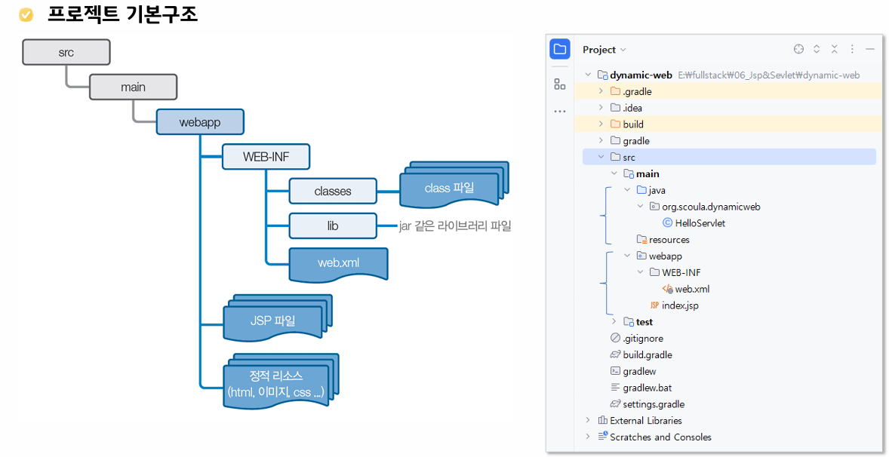

# Servlet

## Day 058 - 2026-06-08

---

## 목차

1. Servlet / JSP

## Servlet / JSP

웹 페이지를 동적으로 생성하는 서버 프로그램

### Tomcat

- JSP / Servlet의 컨테이너
- JSP, Servlet은 컴포넌트

### servlet(JAVA)

- HTML in java
- 9.X 버전 : javax.servlet.annotation.\*;
- 10.X 버전 : jakarta.servlet.http.HttpServletResponse;

- web.xml

### JSP(JAVA SERVER PAGE)

- HTML 기반에 JAVA 코드를 넣을 수 있는 페이지
- java in HTML
- `<h1><%="Hello World"></h1>`

## 정리

### 더 공부할 것

- [ ]

### 기억할 내용
