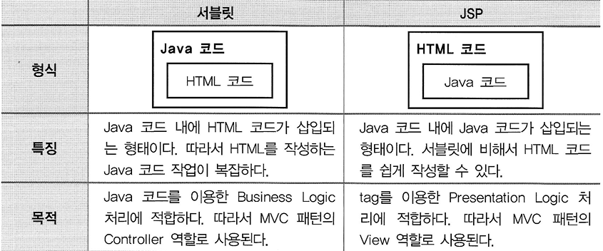
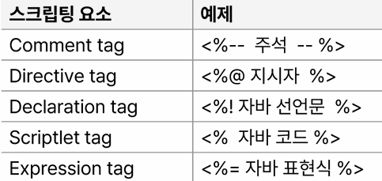

# JSP

## Day 060 - 2026-06-09

---

## 목차

## JSP 이해

- 과거 MODEL1 방식에서는 JSP 이용해서 뷰와 비즈니스 로직 모두 개발함
- MODEL2(MVP : Model, View, Controller) 방식에서는 Sevlet과 같이 사용되며 JSP는 뷰의 역할을 하게 됨
- 태그 기반 웹 컴포넌트로 jsp 확장자을 가짐
- 태그안에 자바 코드를 삽입하여 구현

## JSP 문법

- JSP 스크립팅 요소 <% %> : 안씀
- <%=%> : 안씀
- JSP 표준 액션 태그 요소 : 써도 되지만 잘 안 씀
- **EL 요소**
- **커스텀 태그 라이브러리 요소**

## 정리

### 더 공부할 것

- [ ]

### 기억할 내용
