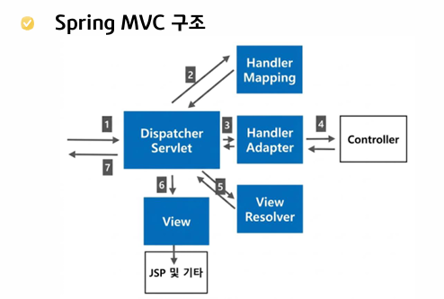

# spring MVC

## Day 065 - 2026-06-16

---

## 목차

## 목차 1

- Handler Maping : DTO 객체로 매핑
- Controller: 비즈니스 로직 : 이후 로직을 개발자가 해야함
  - 여러가지 Return을 Dispatcher Servlet이 담당해 view, jsp, json 등 처리

### Controller의 여러 어노테이션

#### `@RequestMapping(" ")

- 공통 URL 설정시 주로 사용 됨
- 모든 메서드 앞에 Prefix로 붙을 때

#### 매서드별 Mapping

매핑을 통해 Handler Mapping에 저장

- `@GetMapping`
- `@PostMapping`
- `@PutMapping`
- `DeleteMapping`

### 파라미터 정보 추출

- DTO 객체 제시
- DTO 말고 개별 객체 매핑하려면 `@RequestParam("파라미터명")
- 자주 사용되는 날짜에 대해서는 어노테이션으로 자동 형변환 할 수 있음
  - `@DateTimeFormat(pattern="yyyy-MM-dd")

### View 로 정보 전달

- 비즈니스 로직의 결과를 Model객체로 Request 스코프에 저장
- DTO는 자동으로 스코프에 저장 됨
- RequestParam에 해당하는 정보는 @ModelAttribute("속성명")으로 Request 스코프에 저장

### Controller 메서드의 리턴 타입

- String : View(JSP)로 해석
  - `forward:`, `redirect:` 로 작성시 뷰 이름이 아닌 경로로 이동
- Void : View(JSP) 로 해석
- VO, DTO 타입 (객체) : Jakson을 통해 Json 타입으로 변환 (200 결과)
- ResponseEntity : Http 헤더, 바디를 포함한 Json으로 변환 -> RESTapi에 주로 사용됨

- 내가 만든 클래스 : `@Component`
- 제 3자가 라이브러리 형태로 만든 객체: `@Configuration`의 메서드를 통해 `@Bean`

### DI

1. 생성자 : `<constructor-args>`
2. setter : `<property>`

EL / JSTL

- 메서드를 변수처럼 사용함
- `${ dto.getName() }` -> `${ dto.name }`
- spring에서 그대로 사용함

## 정리

### 더 공부할 것

- [ ] Multipart Resolver
- 공통 내용(Mutipart Resolver, 예외처리) 는 템플릿으로 만들어 사용하기도 함
