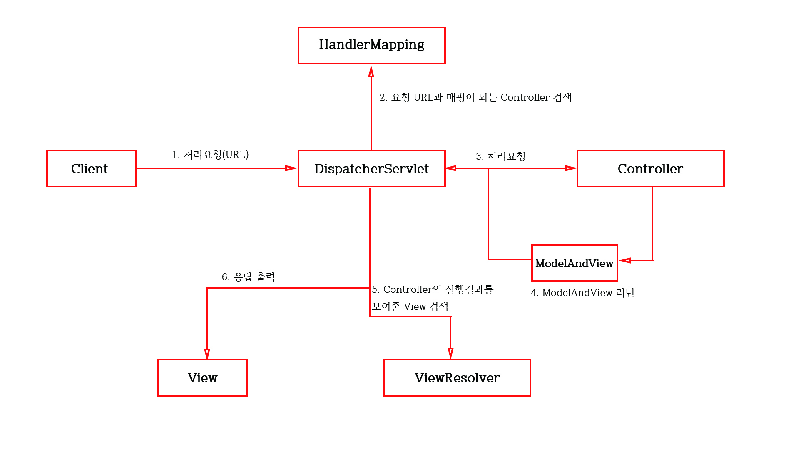

# CRUD

## Day 067 - 2026-06-18

---

## 목차

## 영속, 비즈니스 계층의 CRUD

### create(insert)

- 다른 테이블에 FK로 후속작험 하는 경우(PK 값을 알아야 하는 경우)

```xml
<selectKey resultType="Long"
  keyProperty="no" keyColumn="no" order="AFTER">
  SELECT LAST_INSERT_ID()
</selectKey>
```

### VO와 DTO의 상호 변환 기능

```java
// VO -> DTO
public static BoardDTO of(BoardVO vo){
  return vo==null ? null : BoardTDO.builder()
                            ...
                            .build();
}

// DTO -> VO
public BoardVO toVo{
  return BoardVO.builder()
                ...
                .build();
}
```

- 해당 변환을 지원하는 라이브러리도 존재함

### 생성자를 통한 의존 객체 주입

- `@Autowired` 가장 간편하나 `final` 사용할 수 없음
- 그래서 최근 `@Autowired` 보다 final 권장

```java
@Service
@requiredArgsConstructor
public class BoardServiceImpl implements BoardService{
  final private BoardMapper mapper
}
```

### List<VO> -> List<DTO>

```java
mapper.getList().stream()
      .map(BoardDTO::of)
      .toList();
```

### Optional 처리

- 실패시 null return이 아니라 에러발생시키는 코드

```java
Optional.ofNullable(board)
        .orElseThrow(NoSuchElementException::new);
```

## 빈 설정 방법

1. XML - applicationContext.xml
2. 어노테이션
3. java 파일

### 2. 어노테이션

- `@Component`
- `@Bean`
  - 리턴되는 클래스를 빈으로 등록
  - 메서드명이 반드시 클래스의 아이디와 동일해야 함
- `@Controller`

## 스프링 MVC 복습

[text](<../../../../Users/student/Downloads/스프링 MVC.pdf>)


- HandlerMapping
  - 뚜쟁이(?) 역할만
  - @RequestMapping(Value="/hello") 를 찾기
- HanderAdapter
  - hello Controller의 매핑된 메서드를 HelloAdapter가 콜백
- ModelAndView로 데이터 전달

### 스프링 설정 파일

#### 웹과 상관 없는 설정

-

#### 웹과 상관 있는 설졍

- `/WEB-INF/서블릿이름-servlet.xml`
- 서블릿이름 : `web.xml`에 만들어 둔 이름(`<servelet-name>`)

## 정리

### 더 공부할 것

- [ ] component-scan
- [ ] property

### 기억할 내용
