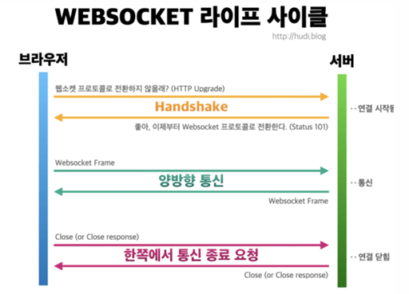

# AOP

## Day 071 - 2026-06-24

---

## 목차

## AOP (Aspect Oriented Programming)

관점(Aspect) 지향 프로그래밍

- 기존으 코드(핵심 비즈니스 로직)을 수정하지 않고, 원하는 기능(관심사)들과 결합
- `aspectj`, `aspectjweaver` 의존 라이브러리 필요

### AOP 용어들

| 용어      | 설명                                           |
| --------- | ---------------------------------------------- |
| Target    | 개발자가 작성한 핵심 비즈니스 로직을 갖는 객체 |
| Advice    | 관심사 로직                                    |
| Proxy     | 타겟을 감싸는 래퍼 클래스                      |
| JoinPoint | AOP를 적용할 Target객체의 메서드               |

- 외부에서의 호출은 Proxy 객체를 통해 Target 객체의 JoinPoint를 호출

#### Advice

| 어노테이션      | 실행 시점/조건                           |
| --------------- | ---------------------------------------- |
| @Around         | 메서드 실행 전/후                        |
| @Before         | JoinPoint 호출 전                        |
| @AfterReturning | 모든 실행이 정상적으로 이루어진 후       |
| @AfterThrowing  | 예외가 발생한 뒤                         |
| @After          | 정상 실행 혹은 예외 발생했을때 모두 실행 |

#### Pointcut

Pointcut : Advice를 어떤 JoinPoint에 결합할 것인지 결정하는 표현식

| 구분            | 설명                                                       |
| --------------- | ---------------------------------------------------------- |
| `execution()`   | 메서드를 기준으로 Pointcut을 설정                          |
| `within()`      | 특정 타입(클래스)을 기준으로 Pointcut을 설정               |
| `this()`        | 주어진 인터페이스를 구현한 객체를 대상으로 Pointcut을 지정 |
| `args()`        | 특정 파라미터를 가지는 대상들만 Pointcut으로 설정          |
| `@annotation()` | 특정한 어노테이션이 적용된 대상들만을 Pointcut으로 설정    |

- 예: Advice + Pointcut

## Spring Web Socket, STOMPE

### HTTP 통신 특징

- 비연결성(connectionless)
- 무상태성(stateless)
- 단방향 통신

### 웹소켓 라이프 사이클

### STOMP (Single Text Oriented Messaging Protocol)

- 간단한 메시지를 전송하기 위한 프로토콜
- 메시지 브로커와 publisher - subscriber 방식을 사용
  - pulisher : 메시지 전송자
  - subscriber : 메시지 수신자 (구독자)
  - broker : publisher가 발행한 메시지를 subscriber에게 전달

1. publisher가 특정 url(topic)으로 전송
2. subscriber는 특정 url(topic)의 정보를 구독
3. 브로커는 특정 url(topic)의 정보를 subscriber에게 전달

### Stomp 컨트롤러

- `@MessageMapping(메시지경로) : publisher의 관심
- '@SendTo' : subscriber의 관심

## 보충 수업

### java와 xml

| 오전               | 오후                                                               |
| ------------------ | ------------------------------------------------------------------ |
| servletConfig.java | servlet-config.xml                                                 |
| RootConfig.java    | applicationContext.xml + SpringConfiguration.java                  |
| WebConfig.java     | web.xml (Tomcat 실행시 자동 읽힘 - 위의 config등 파일 연결해야 함) |

XML 방식 -> Annotation 방식 -> 자바 + Annotation + xml 혼합 방식

### config에 필요한 내용

1. Hikari
2. dataSource
3. TrascationManagment
4. SqlSessionFactory
5. SqlSession

### 어노테이션을 통한 빈 설정 방법

1. @Component(or @Repository or @Service)
2. @AutoWired(or @Setter or @RequiredArgsConstructor)
   - 필드주입 or 세터 주입 or 생성자 주입(권장)

## 정리

### 더 공부할 것

- [ ]

### 기억할 내용
