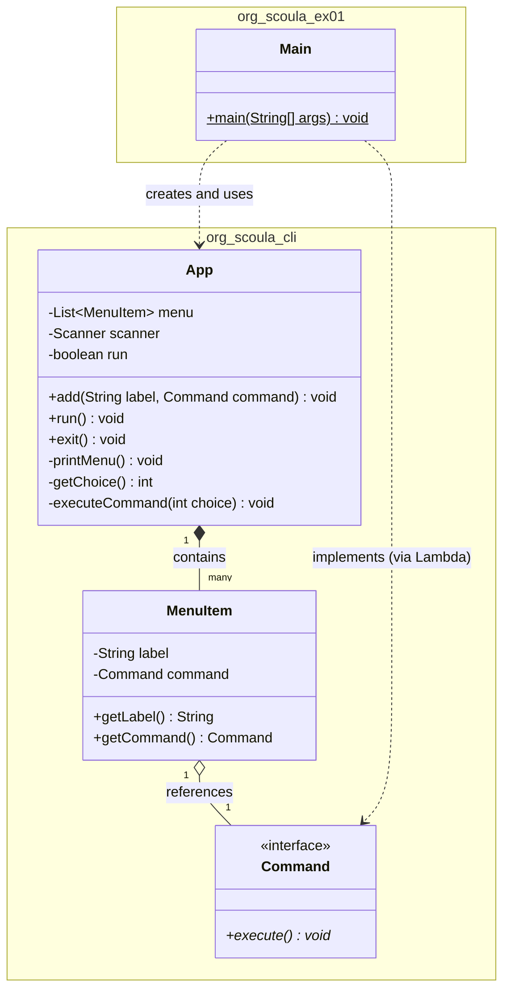

# CLI Framework Class Diagram

이 다이어그램은 `org.scoula.cli` 패키지의 프레임워크 구조와 `org.scoula.ex01` 패키지에서의 활용 구조를 보여줍니다.

## 주요 클래스 설명

1. **org.scoula.cli.Command**: Command 패턴의 인터페이스입니다. 모든 기능은 이 인터페이스의 `execute` 메서드를 통해 실행됩니다.
2. **org.scoula.cli.App**: 애플리케이션의 핵심 엔진입니다. 메뉴 항목을 관리하고 사용자 입력을 받아 명령을 실행하는 메인 루프를 포함합니다.
3. **org.scoula.cli.MenuItem**: 메뉴의 이름(label)과 해당 메뉴 선택 시 실행될 명령(Command)을 묶어 관리하는 데이터 구조입니다.
4. **org.scoula.ex01.Main**: 프레임워크를 실제로 사용하는 진입점 클래스입니다. 메뉴를 구성하고 앱을 실행합니다.
