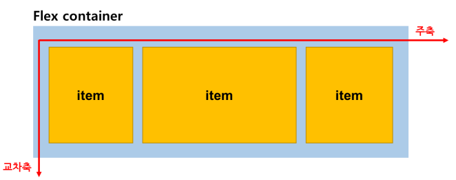

# Layout

## Day 020 - 2026-03-31

---

## 목차

1. Flexbox
2. Grid
3. 반응형 웹(Responsive web)

## Flexbox

- 과거에는 position, float, table 등을 사용
- 레이아웃 전용도구도 반응형으로 대응하지 못함

- **Flexbox** 의 등장 : `display:flex`
- 흐름을 유지, 공간을 자동으로 분배, 구조가 단순하고 일관적

### Flex Container 속성

- flex-direction
  - row, col (주축을 가로, 세로)
    

- flex-wrap
  - nowrap(기본): 절대 줄바꿈 없음, 부모 container 밖으로 나감
  - wrap, wrap-reverse: 공간이 넘치면 다음주로 넘김 (reverse 는 위로 넘김)

- justify-content
  - **주축 방향으로 요소를 정렬**
  - flex-start(기본), **center**, **flex-end**, **space-between**, space-around, space-evenly

- align-items
  - 교차축 방향으로 요소를 정렬
  - flex-start, start-end, **center**, baseline, stretch(기본값)
  - 각 요소마다 크기가 있다면 stretch 무시됨

- align-self
  - flex item 을 각각 원하는 위치로 배치할 수 있음
  - 자식요소에 직접 적용하는 방식
  - align-items랑 값은 같음

### Flex Item 속성

- flex-grow
  - 공간을 비율로 나눔(부모 영역에서 고정된 값 외의 나머지)
  - 기본값 0, 숫자 클수록 많이 차지
  - flex-basis로 기본 width 지정(width로 지정시 고정, flex-basis로 지정시 반응형)
  - basis:0 일때 같은 비율로 나눠갔기 때문에 중요함!(데이터에 따라 뚱뚱해지거나 얇아질 수 있음)

- flex-shrink
  - 부족한 공간을 줄임
  - 기본값:1
  - 자식이 부모보다 벗어나는 경우 자동으로 줄여줌(grow 처럼 비율로)

> [!IMPORTANT]
> **실무에서 많이 사용하는** `flex:1`
> `flex:1` : 모든 요소가 동인한 크기로 나뉜다
> flex:1 = grow:1, shrink:1, basis:0
> 공간이 부족해도, 공간이 남아도 자동으로 계산, 배치해줌

> [!TIP]
> CSS 연습 사이트
> [초보 연습](https://flexboxfroggy.com/#ko)
> [심화 연습](https://www.flexboxdefense.com/)

## Grid

- 2차원 레이아웃 시스템
- 행(row), 열(column)을 동시에 설계 가능
- 전체 화면 구조를 직관적으로 나눔
- 전체 구성을 만들고, 자식을 끼워넣는 방식

### Grid Container

- 구조의 기준 영역(부모 요소)
- `display:grid`

- `grid-template-columns: 100px 100px 100px` : 100px 컬럼 3개 생성(이후엔 자동 줄바꿈)
  - `grid-template-columms: 1fr 1fr 1fr`
  - `grid-template-columns: repeat(3,200px 1fr)`
- `grid-template-rows: 80px 80px`: 로우 생성
- `gap: 10px` : item 간격에 갭 생성(끝, 모서리 부분 X)
- reapeat+minmax(최소, 최대) : overflow 발생 가능 -> `(repeat(auto-fit,minmax(200px, 1fr)))`

- fr(fraction) 단위
  - grid 에서만 사용
  - 남는 공간을 **비율**로 나누는 단위
  - column에 주로 사용 ( 일반적으로 row 는 자동 결정하므로 남는공간 없음)
  - 부모의 높이가 남는 경우만 row에 fr 사용

### Grid Item

- 격자 안에 배치되는 실제 요소

## 반응형 웹(Responsive web)

- 하나의 코드로 모바일, 테블릿, 데스크탑 대응
- 모바일을 기준으로 만들기 시작

### 반응형 웹 만드는 방법

1. css(flex, grid)로 해결
2. media query(크기에 따라 다르게 적용)

### CSS 프레임워크

- 컴포넌트 기반의 Bootstrap : 속도 (link로 전체 가져오기)
- 유틸리티 기반의 Tailwind : 자율성 (script로 사용 부분만 가져오기)
- 디자인 시스템 기반 Meterial UI : 일관성

## 정리

- 상황에 따라 flex와 grid를 적절히 사용!
- 뼈대를 잡을때는 grid, 세부 내용은 flex로

- CSS 관리의 한계
  - 스타일반복증가
  - 수정비용증가
  - 코드복잡도증가
- Scss 방식(과거 Sass방식의 현 방식) : 현업에서 뗄 수 없음
  - Live Sass Compile(extension) : scss -> css 로 변환해줌

- BEM(Block, Element, Modifier) : 클래스 네이밍 규칙
  - Block : 단독 사용
  - Element : 자식 (부모\_\_이름)
  - Modifier : 변형 (부모--동작)

### 기억할 내용

- margin: 외부 여백, padding: 내부 여백
