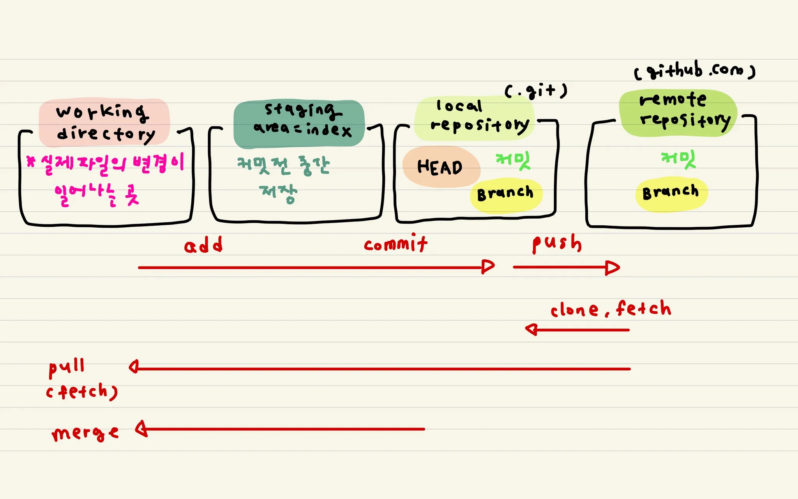

# git
## Day 010 - 2026-03-17

---
## 목차

## GIT 개념
- `git config`
-  `echo` : 출력, `>` : 덮어쓰기

```md
echo "git basic class" > README.md
```

### 리눅스 명령어
<table>
  <thead>
    <tr>
      <th>카테고리</th>
      <th>명령어</th>
      <th>풀네임</th>
      <th>설명</th>
    </tr>
  </thead>
  <tbody>
    <tr>
      <td>도움말</td>
      <td><code>man</code> (<code>help</code>)</td>
      <td>manual</td>
      <td>명령어에 대한 매뉴얼 조회</td>
    </tr>
    <tr>
      <td rowspan="5">경로 접근과<br>내용 보기</td>
      <td><code>ls</code></td>
      <td>list</td>
      <td>디렉토리 내 파일 조회</td>
    </tr>
    <tr>
      <td><code>ls -al</code></td>
      <td>list (all, long format)</td>
      <td>숨김 파일(<code>.</code>으로 시작)까지 조회</td>
    </tr>
    <tr>
      <td><code>clear</code></td>
      <td>-</td>
      <td>현재 콘솔에 출력된 내용 지우기</td>
    </tr>
    <tr>
      <td><code>cd</code></td>
      <td>change directory</td>
      <td>경로 변경 (<code>.</code> 현재, <code>..</code> 상위, <code>~</code> home, <code>-</code> 직전)</td>
    </tr>
    <tr>
      <td><code>pwd</code></td>
      <td>print working directory</td>
      <td>현재 있는 위치 출력</td>
    </tr>
    <tr>
      <td rowspan="7">파일 생성,<br>삭제, 읽기</td>
      <td><code>touch</code></td>
      <td>-</td>
      <td>빈 파일 생성</td>
    </tr>
    <tr>
      <td><code>echo</code></td>
      <td>-</td>
      <td>인자를 콘솔(standard output)에 출력</td>
    </tr>
    <tr>
      <td><code>cat</code></td>
      <td>concatenate and print</td>
      <td>인자에 있는 파일을 전부 읽어서 콘솔에 출력</td>
    </tr>
    <tr>
      <td><code>cp</code></td>
      <td>copy</td>
      <td>파일 복사</td>
    </tr>
    <tr>
      <td><code>cp -R</code></td>
      <td>copy (recursive)</td>
      <td>디렉토리도 전부 복사</td>
    </tr>
    <tr>
      <td><code>mv</code></td>
      <td>move</td>
      <td>파일 이동 / 이름 변경</td>
    </tr>
    <tr>
      <td><code>rm</code></td>
      <td>remove</td>
      <td>파일 삭제 (디렉토리 제거 불가)</td>
    </tr>
    <tr>
      <td rowspan="1">※ 옵션</td>
      <td><code>rm -rf</code></td>
      <td>remove (recursive, force)</td>
      <td>명시된 경로의 전부를 강제로 삭제</td>
    </tr>
    <tr>
      <td rowspan="2">디렉토리<br>생성, 삭제</td>
      <td><code>mkdir</code></td>
      <td>make directory</td>
      <td>디렉토리 생성</td>
    </tr>
    <tr>
      <td><code>rmdir</code></td>
      <td>remove directory</td>
      <td>디렉토리 삭제</td>
    </tr>
    <tr>
      <td rowspan="3">텍스트<br>에디팅</td>
      <td><code>vi</code></td>
      <td>vim editor</td>
      <td>vim editor로 현재 파일을 편집</td>
    </tr>
    <tr>
      <td><code>esc</code> → <code>:</code> → <code>q!</code></td>
      <td>quit</td>
      <td>vim 탈출 (저장 없이 종료)</td>
    </tr>
    <tr>
      <td><code>esc</code> → <code>:</code> → <code>wq</code></td>
      <td>write &amp; quit</td>
      <td>vim 저장 후 종료</td>
    </tr>
    <tr>
      <td rowspan="7">그 외</td>
      <td><code>history</code></td>
      <td>-</td>
      <td>명령어 사용 이력 조회</td>
    </tr>
    <tr>
      <td><code>grep</code></td>
      <td>global regular expression print</td>
      <td>키워드 검색 후 콘솔에 출력</td>
    </tr>
    <tr>
      <td><code>find</code></td>
      <td>-</td>
      <td>파일 검색</td>
    </tr>
    <tr>
      <td><code>export</code></td>
      <td>-</td>
      <td>환경변수 세팅</td>
    </tr>
    <tr>
      <td><code>alias</code></td>
      <td>-</td>
      <td>명령어에 별명 붙이기</td>
    </tr>
    <tr>
      <td><code>ps -ef</code></td>
      <td>-</td>
      <td>현재 실행 중인 프로세스 목록 확인</td>
    </tr>
    <tr>
      <td><code>exit</code></td>
      <td>-</td>
      <td>터미널 종료</td>
    </tr>
  </tbody>
</table>


### GIT 구조



### GIT 명령어
| 카테고리 | 명령어 |
|----------|--------|
| 1. 도움말과 설정 | `git help` `git config` |
| 2. 저장소 생성, 복제 | `git init` `git clone` |
| 3. 스냅샷 저장하기(커밋) | `git add` `git status` `git diff` `git commit` `git log` `git show` `git rm` `git mv` |
| 4. 브랜치 | `git branch` `git checkout` `git merge` `git rebase` `git stash` `git tag` `git restore` |
| 5. 원격 | `git remote` `git fetch` `git pull` `git push` |
| 6. 커밋 수정하기 | `git reset` `git rebase -i` `git revert` `git cherry-pick` `git clean` |
| 7. 기타 | `git bisect` `git blame` `git grep` `git reflog` `git describe` |
## 정리

### 더 공부할 것

- [ ]

### 기억할 내용
